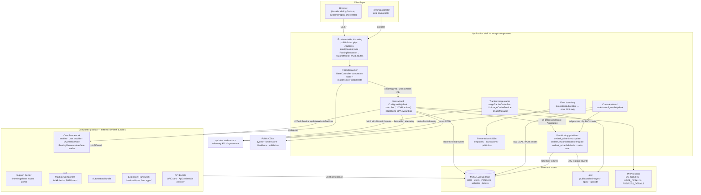

# High-Level Design — UVdesk Community Skeleton

**Phase:** High Level Design
**Repository:** `uvdesk/community-skeleton`
**Architecture role:** Distribution/composition shell for the UVdesk open-source helpdesk

---

## 1. System Overview

The repository is the **UVdesk Community Skeleton** (`uvdesk/community-skeleton`), a Composer `type: project` distribution that assembles the UVdesk open-source helpdesk from six separately versioned Symfony bundles and contributes the runtime shell needed to install, configure, and operate a composed instance. The logical design is split across two ownership boundaries:

- **In-repository application shell.** A Symfony 5.4-based front controller, a state-driven root dispatcher, a first-run installation wizard (web and console), three hidden provisioning commands, a production error boundary, a tracker-logo image cache, localization catalogs, and the YAML composition root that binds everything together.
- **Dependency-delivered product runtime.** The helpdesk domain itself — core framework (users, tickets, websites, roles), support center, mailbox component, automation bundle, extension framework, and API bundle — registered in `config/bundles.php` and required in `composer.json`. None of that domain code exists in this repository; it is composed in at install time.

The design is therefore a **distribution/composition architecture**: the skeleton owns provisioning, bootstrapping, presentation defaults, and operational boundaries, while the domain is contributed by external bundles that the skeleton references by class, entity, service, route, and interface name throughout its code and configuration.

## 2. Logical Component Map

The diagram emphasizes two structural facts. First, the root dispatcher is the **single gate between lifecycle stages**: the same URL serves the installer before configuration and the product afterward. Second, the web wizard, console wizard, and provisioning primitives form one **convergent provisioning core** with two execution styles — in-process console invocation from the web controller, and subprocess invocation from the console command.

## 3. Component Responsibilities

### 3.1 Front controller and routing composition

Owns the HTTP entry boundary. `public/index.php` boots the application through `vendor/autoload_runtime.php` and constructs `App\Kernel`; `public/.htaccess` rewrites all non-file requests to the front controller and forwards the `Authorization` header (required for the API firewall). Route discovery is *composed*: `config/routes.yaml` declares two custom resource types (`uvdesk`, `uvdesk_extensions`) whose loaders live in the core and extension bundle, and `src/Routing/RoutingResource` implements the core framework's `RoutingResourceInterface` to contribute the skeleton's own YAML route file (`src/Resources/config/routes.yaml` — the eleven wizard XHR endpoints plus the tracker image route) into the composed route table. The front controller therefore does not enumerate routes; it delegates route assembly to the bundles, and the bundles discover the skeleton's routes through the interface contract.

### 3.2 Root dispatcher (installation-state gate)

`BaseController::base()` (`GET /`, `base_route`) decides what the site root answers based on persisted state:

- If a `SUPER_ADMIN` or `ADMIN` support role exists **and** at least one user instance carries it, the instance is considered installed: a 301 redirect goes to `helpdesk_knowledgebase` when the support-center bundle is loaded and a `knowledgebase` website record exists, otherwise to `helpdesk_member_handle_login`.
- Otherwise — and on **any** exception, including an unreachable database — the request is forwarded to `ConfigureHelpdesk::load`, rendering the wizard.

This component owns no state; it is a pure decision function over core-framework entities (`SupportRole`, `UserInstance`, `Website`). Its empty exception handler makes the wizard the system's failure fallback: any database outage at the root degrades to the installer page rather than an unhandled error.

### 3.3 Web wizard (`ConfigureHelpdesk` controller + Backbone SPA)

The largest in-repo component. Server-side, it exposes eleven XHR endpoints under `/wizard/xhr/…` covering four concerns:

1. **Readiness evaluation** (`check-requirements`) — PHP version, required extensions (`imap`, `mailparse`, `mysqli`), `max_execution_time`, writability of `.env` and of `config/packages/uvdesk.yaml`/`uvdesk_mailbox.yaml` (with attempted `chmod 0666` remediation), and an advisory Redis notice.
2. **Credential staging** — `verify-database-credentials` opens a standalone DBAL connection (creating a temporary Doctrine ORM via `Setup::createAnnotationMetadataConfiguration` outside the container) and buffers the DSN parts in `$_SESSION['DB_CONFIG']`; `intermediary/super-user` buffers admin name/email/password in `$_SESSION['USER_DETAILS']`; `website-configure` (GET/POST) reads current or stages new member/customer URL prefixes in `$_SESSION['PREFIXES_DETAILS']`.
3. **Installation execution** — four sequential `load/*` actions invoked by the client: `load/configurations` builds the `mysql://` DSN, creates the database if requested, and runs the hidden `uvdesk_wizard:env:update` command **in-process** through a `Symfony\Component\Console\Application` constructed on the kernel; `load/migrations` runs `uvdesk_wizard:database:migrate`; `load/entities` runs `doctrine:fixtures:load --append`; `load/super-user` creates or promotes the administrator directly through the ORM and the framework password encoder.
4. **Finalization** — `load/website-configure` persists the buffer prefixes through the core bundle's `UVDeskService::updateWebsitePrefixes` and fires the installation-attribution telemetry call (reusing the static tracker method of the console wizard command class).

Client-side, `public/scripts/wizard.js` is a single-page Backbone.js application (jQuery 2.2.4, Underscore 1.9.1, Backbone 1.3.3, Backbone.Validation 0.7.1 from CDNs) rendering into placeholders in `templates/installation-wizard/index.html.twig`. It owns the wizard's conversation flow: per-stage models with debounced validation, step gating, an async finalization chain that awaits each `load/*` response in sequence, and the success screen with the resulting panel URLs.

### 3.4 Console wizard and provisioning primitives

`src/Console/Wizard/ConfigureHelpdesk` (`uvdesk:configure-helpdesk`) is the terminal twin of the web wizard. It executes three remediation checks:

1. **Database connectivity** — parses `DATABASE_URL` from `.env`, probes via DBAL, and on failure interactively collects host/port/database/user/password with retry loops and optional database creation; the corrected DSN is written back by launching `php bin/console uvdesk_wizard:env:update` as a **subprocess** (`Symfony\Component\Process\Process`).
2. **Schema drift** — versions all migrations, diffs the schema, and, with operator consent, runs `doctrine:migrations:migrate` (900 s timeout) and `doctrine:fixtures:load --append` (120 s timeout), again as subprocesses.
3. **Super-admin existence** — probes `uv_support_role`/`uv_user_instance`/`uv_user` with raw PDO and, when absent, interactively collects validated details and creates the account via `uvdesk_wizard:defaults:create-user --no-interaction`.

It also normalizes permissions (`chmod 0775`) on `.env`, `var/`, `config/`, `public/`, `migrations/` at startup and reports installation attribution to the tracker on success.

The three hidden primitives under `src/Console/` are the shared substrate:

- **`EnvironmentVariables`** (`uvdesk_wizard:env:update`) — in-place, comment-preserving rewrite of a single key in `.env`; **refuses to run outside the `dev` environment**.
- **`MigrateDatabase`** (`uvdesk_wizard:database:migrate`) — branches on table presence: empty database → `doctrine:schema:create` plus fixture load; populated database → metadata-sync, version-add, diff, status, and migrate-to-latest via in-process command dispatch.
- **`DefaultUser`** (`uvdesk_wizard:defaults:create-user`) — role-aware, idempotent user creation treating member-level roles (1–3) as interchangeable and role 4 (customer) as distinct.

### 3.5 Tracker image cache

A self-contained vertical slice: `ImageCacheController::getCachedImage` (`GET /tracker/xhr/get/cacheImage`) → `UrlImageCacheService::getCachedImage` → `ImageManager`. The service computes an md5 key on the canonical logo URL, creates `public/cache/images/` on demand (mode 0775), honors a one-week TTL (delete and re-fetch on expiry), and returns a filesystem path; the custom `ImageManager` (a subclass of Intervention's manager) fetches the remote image with browser-like headers — including a `Domain` header carrying the requesting site's origin — and decodes the bytes through the configured driver. The controller returns the **site-relative URL** of the cached file as JSON, so remote tracker scripts render the logo from the local installation. The endpoint presupposes an image driver and outbound URL fetching; the shipped container image does not explicitly install a GD/Imagick extension, so operation inside the container is unverified.

### 3.6 Error boundary

`ExceptionSubscriber` listens on `KernelEvents::EXCEPTION` (priority 10). **Only in the `prod` environment** it translates three classes of failure into branded pages rendered from `templates/errors/error.html.twig`: 403 for authenticated sessions (anonymous 403s are left to the framework's login redirect), 404, and everything else as 500. The template pulls knowledge-base branding through the `user_service` Twig global, so the error surface is bound to composed-bundle state.

### 3.7 Configuration and assembly layer

`config/` is the composition root owning the boundary between the shell and the bundles:

- `bundles.php` registers the six bundles for all environments; `services.yaml` autowires/autoconfigures `src/`, tags controllers with `controller.service_arguments`, and defines `locale: en` and `uvdesk.version: v1.1.8`.
- `config/packages/` pins the shared infrastructure:
  - **Doctrine** (`pdo_mysql`, server 5.7, `utf8mb4`, `App\Entity` annotation mapping plus auto-mapping of bundle entities).
  - **Security** (role hierarchy, three firewalls — member panel, `/api`, customer portal — whose path patterns interpolate the configurable prefix parameters).
  - **Twig globals** exposing bundle services (`uvdesk.service`, `user.service`, `ticket.service`, `email.service`, `recaptcha.service`, `uvdesk.automations`, `uvdesk.extensibles`, file-system service, CSRF token manager).
  - **Mailer transport** (`MAILER_DSN`).
  - **Translation** (English default/fallback).
  - **Extension directory** (`apps/`).
  - **UVdesk package parameters** (supported locales, upload limits, default ticket/template settings, upload manager).
- `uvdesk_mailbox.yaml` carries only a commented template for IMAP/SMTP mailbox configuration.

### 3.8 Presentation and localization

Three templates ship: the wizard page, the error page, and `mail.html.twig` (registered as the default email template in `uvdesk.yaml`). Twelve message catalogs (`translations/messages.{ar,da,de,en,es,fr,he,it,pl,pt_BR,tr,zh}.yml`; `en` default and fallback) localize the composed bundles' UI. The wizard's own strings are hardcoded English and do not use the catalogs.

### 3.9 Deployment packaging

The Dockerfile builds an Ubuntu-based image with Apache, PHP 8.1 (`imap`, `mailparse`, `mysql`, `curl` extensions), a MySQL server, Composer, and gosu; dependencies are installed at build time and writable paths are pre-chmodded. The entrypoint restarts Apache/MySQL, provisions the database/user from `MYSQL_*` environment variables (writing client configs for root and the `uvdesk` user), and drops privileges before executing the container command. This is an operational boundary around the same application shell, not a separate logical component.

## 4. Interfaces Between Components

| Boundary | Mechanism | Data crossing | Evidence |
|---|---|---|---|
| Skeleton routes → bundle route table | `RoutingResourceInterface` + custom loader types `uvdesk`/`uvdesk_extensions` | YAML route declarations | `src/Routing/RoutingResource.php`, `config/routes.yaml` |
| Web wizard → provisioning primitives | In-process `Console\Application` on `$kernel` | command name + arguments (DSN, flags) | `ConfigureHelpdesk::updateConfigurationsXHR` / `migrateDatabaseSchemaXHR` / `populateDatabaseEntitiesXHR` |
| Console wizard → provisioning primitives / Doctrine | `Process` subprocess `php bin/console …` | command line, exit codes | `Console/Wizard/ConfigureHelpdesk` |
| Wizard ↔ session | Native PHP session (`storage.factory.native`) | `DB_CONFIG`, `USER_DETAILS`, `PREFIXES_DETAILS` | `ConfigureHelpdesk` controller actions |
| Wizard → core bundle services | Service autowiring / method injection | prefix values in/out of `UVDeskService::updateWebsitePrefixes`/`getCurrentWebsitePrefixes` | `websiteConfigurationXHR`, `updateWebsiteConfigurationXHR` |
| Skeleton → bundle entities | Doctrine repositories + ORM | `SupportRole`, `UserInstance`, `User`, `Website` | `BaseController`, `DefaultUser`, `createDefaultSuperUserXHR` |
| Web wizard → console wizard class | Static method call | user details for telemetry | `updateWebsiteConfigurationXHR` → `Helpdesk::addUserDetailsInTracker` |
| Exception boundary → bundles/Twig | Event subscriber + Twig globals | exception event, website branding | `ExceptionSubscriber`, `error.html.twig` |
| Skeleton → tracker service | cURL POST; HTTP client fetch | `{name, email, domain}`; logo bytes with `Domain` header | `addUserDetailsInTracker`, `ImageManager::initFromUrl` |
| Shell ↔ bundles (runtime) | Firewall config, Twig globals, parameters | authentication flow, template globals, URL prefixes | `security.yaml`, `twig.yaml`, `uvdesk.yaml` |
| Shell ↔ filesystem | Direct file I/O | `.env` keys; cached PNG; writability probes | `EnvironmentVariables`, `UrlImageCacheService` |

The most distinctive interface is the **route-contribution contract**: rather than the skeleton declaring its routes at the top level, it plugs into the core bundle's resource-discovery mechanism. Similarly, both provisioning surfaces funnel through the three hidden commands, giving web and CLI identical semantics for environment mutation, schema handling, and account creation.

## 5. Representative Workflows

### 5.1 Fresh installation (web)

1. Browser requests `/`; Apache rewrites to the front controller; the kernel boots.
2. `BaseController::base()` finds no support roles (or the database is unreachable) and forwards to `ConfigureHelpdesk::load`, which renders the wizard page and loads the SPA dependencies from CDNs.
3. The SPA stages through readiness checks → database credentials → admin details → URL prefixes; each accepted stage is buffered in the server session, so the client holds no provisioning state of its own.
4. "Install Now" triggers the async chain: `load/configurations` (DBAL connect/create + in-process `uvdesk_wizard:env:update` writing `DATABASE_URL` into `.env`) → `load/migrations` (fresh-database branch: schema create + fixtures) → `load/entities` (fixture append) → `load/super-user` (idempotent super-admin creation) → `load/website-configure` (prefix persistence via the core service + best-effort telemetry).
5. The success screen shows the member-login and knowledge-base URLs derived from the persisted prefixes. The next root request hits the redirect branch of `BaseController`.

**Responsibility transitions:** client SPA (conversation and validation) → web controller (session staging and command orchestration) → console commands (file-system and schema mutation) → core bundle service (domain prefix persistence). The transition into the console application is where side effects gain their transactional, framework-level semantics.

### 5.2 Configuration remediation (terminal)

`uvdesk:configure-helpdesk` reads `.env`, probes the database, and — depending on findings — rewrites `DATABASE_URL` (subprocess), migrates and re-fixes the schema (subprocesses with timeouts), and provisions a missing super-admin (subprocess). All three steps reuse the same primitives the web wizard uses, but through an operator-consented, interactive flow with explicit abort semantics and non-zero exit codes.

### 5.3 Production traffic (post-installation)

Requests under the configured member prefix are protected by form login against the core `user.provider`; `/api` by the API bundle's `APIGuard` against `ApiCredentials`; the customer prefix by `ROLE_CUSTOMER` with explicitly anonymous login/registration/ticket-creation paths. Unhandled exceptions in `prod` terminate at the `ExceptionSubscriber` boundary and render localized branded pages. The tracker endpoint serves a locally cached logo so remote scripts can reference the site without exposing the tracker URL. This entire path is owned by the composed bundles; the skeleton supplies only the firewall wiring, the error surface, and the logo cache.

## 6. Dependency Direction and Coupling

Dependency direction is **consistently inward-toward-the-bundles**: every in-repo runtime component depends on bundle classes (entities, `UVDeskService`, `user.provider`, `RoutingResourceInterface`, API guards), while the bundles depend on the shell only through declared contracts — the routing-resource implementation, the extension directory, the writable paths, the translation catalogs, and the Twig-default parameters that `uvdesk.yaml`/`twig.yaml` establish. No in-repo component is imported by bundle code in a way verifiable from this repository.

Material coupling characteristics:

- **Two provisioning surfaces share one substrate, but execute it differently** — the web controller builds a `Console Application` in-process; the console command shells out to `php bin/console`. Semantics converge; failure surfaces differ (HTTP 500 vs. `ProcessFailedException`/exit codes).
- **Web-to-console class reuse** — the web controller invokes the *console wizard command class* statically for telemetry, coupling the HTTP layer to a CLI class (a utility-bearing dependency rather than command execution).
- **Direct low-level access in provisioning** — the wizard and console command bypass the container's Doctrine wiring with their own DBAL connection, a temporary annotation-configured ORM, and raw PDO queries against `uv_*` tables, duplicating persistence knowledge that otherwise lives in the core bundle. This is deliberate provisioning pragmatism (the container's entity manager is not usable before `DATABASE_URL` is valid), but it means provisioning logic *and* production logic each encode the entity schema.
- **Service-locator style mixed with modern DI** — `EnvironmentVariables`, `DefaultUser`, and `MigrateDatabase` receive `ContainerInterface` (and pull the kernel/entity manager per-command) rather than typed autowiring, while controllers use method injection; the shell is internally heterogeneous in its dependency style.
- **Environment gating coupling** — `uvdesk_wizard:env:update` refuses non-`dev` environments, yet it is the web wizard's configuration step. A wizard run under `APP_ENV=prod` fails at the configuration stage by design; the shipped `.env` default (`dev`) keeps the documented flow working.

## 7. State Ownership and Lifecycle

| State | Owner | Lifecycle | Written by |
|---|---|---|---|
| Wizard staging (`DB_CONFIG`, `USER_DETAILS`, `PREFIXES_DETAILS`) | PHP session | Transient — lost on session expiry; must be re-entered | Web wizard controller |
| `DATABASE_URL` | `.env` (file system) | Persistent; mutated only in dev by `env:update` | `EnvironmentVariables` via web/console flows |
| Schema, roles, users, instances, websites, tickets | MySQL via Doctrine | Persistent; created by wizard, maintained by bundles | `MigrateDatabase`, `DefaultUser`, fixtures, bundle runtime |
| URL prefixes | Core bundle `Website` records (+ `uvdesk.yaml` parameter defaults) | Persistent; default parameters, DB values authoritative | `UVDeskService::updateWebsitePrefixes` |
| Tracker logo | `public/cache/images/<md5>.png` | Ephemeral — 7-day TTL, re-fetched on expiry | `UrlImageCacheService` |
| Extension add-ons | `apps/` directory | Persistent, operator-delivered | Extension framework |
| Session/cookie lifetime | `UV_SESSION_COOKIE_LIFETIME` (default 1440 s) | Framework configuration | Configuration |

The lifecycle model is **state-gated**: the root dispatcher's redirect-vs-wizard decision derives from DB state, wizard staging lives in the session, and the final transition is the `.env` + database write that flips the gate. `uvdesk.yaml`/`uvdesk_mailbox.yaml` are *probed* for writability as an installation precondition, but the current code does not rewrite them — only `.env` is actually mutated by the provisioning flow; the prefix defaults in `uvdesk.yaml` act as fallbacks superseded by database records.

## 8. Synchronous and Asynchronous Design

The repository is overwhelmingly **synchronous request/response**, with two qualified exceptions:

- The wizard's finalization **client chain** (`wizard.js`) is asynchronous across HTTP round-trips — each `load/*` action awaits its predecessor, so the installation pipeline is serialized at the protocol level even though each server action is synchronous and blocking. There is no job queue, worker, or background execution in the shell.
- The tracker telemetry is **fire-and-forget from the caller's perspective**: `addUserDetailsInTracker` swallows all failures so installation never blocks on tracker availability, but the call itself is synchronous cURL within the request.

Scheduled or queued behavior (mailbox fetch loops, automation triggers) belongs to the composed bundles and is not verifiable in this repository.

## 9. Failure and Boundary Behavior

- **Installation gating on failure:** the root dispatcher treats *any* exception — including database unavailability — as "show the wizard," making the installer the system's degraded-state surface before and after misconfiguration.
- **Validation boundaries:** readiness checks (server-side) and field validation (client-side, debounced) gate each wizard stage; the console wizard applies the same rules interactively (email format, 8–32-character passwords, matching confirmation).
- **Provisioning failure semantics:** web-stage failures surface as HTTP 500 with inline remediation text (the client stops that stage's progress but continues the chain — a documented client weakness: a failed stage does not terminate the pipeline). Console failures produce ANSI status output, non-zero exits, and operator consent before destructive migration steps.
- **Environment-sensitive error suppression:** the global exception subscriber renders branded pages only in `prod`; in `dev` the framework's debug handler takes over.
- **External-dependency isolation:** tracker availability cannot break installation (caught cURL), and the logo fetch failure surfaces as an image-cache miss rather than a routed error (the endpoint assumes the upstream is reachable). CDN availability is a hard client dependency of the wizard page.
- **Idempotency guards:** super-admin creation is idempotent (skip or promote instead of duplicate); user creation treats member roles as interchangeable; `env:update` writes only on actual change; migrations branch on fresh-vs-existing databases.

## 10. Design Patterns and Principles

Patterns that are structurally evidenced:

- **Composition-root / bundle composition** — the defining pattern: the shell assembles a product from external bundles through declarative registration, service autowiring, route-resource contribution, and parameter/Twig-global contracts.
- **State-gated dispatch (installation-state machine)** — the root controller implements a two-state machine (unconfigured → wizard; configured → product redirects) driven by persisted entity state, with the wizard as the default/fallback state.
- **Session-staged conversational wizard** — a multi-step server-side state machine where the session is the staging store and a client SPA is the view/controller for the conversation.
- **Command-primitive reuse** — web and CLI flows converge on three hidden console commands; the web path instantiates the console application in-process, and the CLI path re-invokes the same commands as subprocesses. This is a real command-pattern substrate, though executed through two different mechanisms.
- **Extension-point contract** — the skeleton contributes routes to a foreign route loader (`RoutingResourceInterface`), and the extension framework consumes the `apps/` directory; both are provider-defined extension points rather than in-repo abstractions.
- **Custom client for a remote dependency** — `ImageManager` subclasses Intervention's manager to add URL fetching with a `Domain` header, an adapter-like isolation of the tracker-fetch concern inside the cache slice.

Patterns that are **not** established: there is no repository-pattern abstraction in the shell (bundle repositories are consumed directly), no hexagonal/clean layering (the shell freely mixes HTTP, CLI, raw DBAL, and file I/O in provisioning), and no event bus beyond the single kernel-exception subscription.

## 11. Intended vs. Implemented Design

- **The distribution model matches its documentation.** The README's "standard distribution" list matches `composer.json` constraints and `bundles.php` registrations; `CONTRIBUTING.md` names the same component repositories, corroborating that product behavior lives in the bundles.
- **Route contributions work as designed, with a delivery caveat.** `RoutingResource` and `config/routes.yaml` establish the intended two-way integration, but `App\Kernel` and `bin/console` — instantiated by the front controller and invoked by the console flows — are absent from this snapshot; the repository as cloned cannot boot standalone. This is a snapshot-completeness gap of a Composer-distributed project artifact, not a design divergence.
- **Config-file writability is required but not actually used for writing.** The readiness check demands write access to `uvdesk.yaml`/`uvdesk_mailbox.yaml`, and the CLI chmods `config/`; the executing code only rewrites `.env`. The requirement reflects the intended mutable-config design; the implemented flows persist runtime-affecting values in the database instead.
- **`.env.example` is a stale Laravel-style template** (`APP_KEY`, `DB_HOST`, `MAIL_DRIVER`, `QUEUE_DRIVER`) that no consumed code reads; the operative contract is the Symfony-style `.env`. A copy-paste installer following the example would produce a broken configuration.
- **Licensing declarations conflict** (composer `MIT` vs. `LICENSE.txt`/README `OSL-3.0`), a documentation-level drift with no behavioral impact.
- **The wizard's UI is not localized** despite twelve shipped catalogs — the catalogs serve the composed product, not the installer.

## 12. Open Questions

- **Bundle-internal design** — the composed product's logical organization (ticket lifecycle, mailbox fetch loop, automation semantics, extension loading protocol, API surface) is not analyzable from this repository; the relationships shown here rest on wiring evidence (entities, service names, routes, firewalls, globals) and product documentation.
- **Image driver availability in the container** — the Docker runtime installs no explicit GD/Imagick extension, so the tracker cache behavior inside the shipped image is unverified.
- **Consumable-project packaging** — how the absent `Kernel.php`/`bin/console` are supplied to consuming installs (create-project templates, Flex recipes) is evidenced only indirectly via `extra.symfony.endpoint` pointing at the `uvdesk/recipes` channel.
- **Resolved dependency versions** — only constraint ranges exist (no `composer.lock` committed); the actually installed bundle set at any given time is unverified.
- **No test suite or CI artifacts exist**, so the behavioral guarantees of the provisioning pipeline rest on the implemented code paths rather than automated verification.
