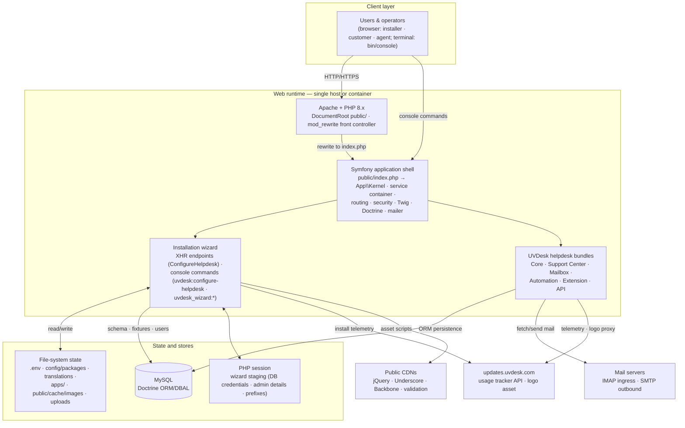

# Technology Architecture — UVdesk Community Skeleton

## 1. System Overview

The repository is the **UVdesk Community Skeleton** (`uvdesk/community-skeleton`), a Composer project package (`type: project`) that serves as the installation, composition, and configuration layer for the UVdesk open-source helpdesk product. It is a Symfony-based application shell that does not itself implement helpdesk functionality; instead it assembles six separately versioned UVdesk bundles and contributes the capabilities this repository actually owns: a first-run installation wizard (web and console), root-request dispatch, production error pages, an installation-telemetry image proxy, localization catalogs, container deployment support, and the configuration wiring of the delivered system.

The architecture is therefore split across two ownership boundaries:

- **In-repo runtime surface** — the Symfony shell (`config/`, `public/`, `src/`), the installer wizard (front end `public/scripts/wizard.js` + backend `src/Controller/ConfigureHelpdesk.php` + console commands under `src/Console/`), the root dispatcher (`src/Controller/BaseController.php`), the error subscriber, and the tracker image cache.
- **Dependency-delivered product runtime** — the helpdesk domain implementation provided by the UVdesk bundles at install time (`uvdesk/core-framework`, `uvdesk/support-center-bundle`, `uvdesk/mailbox-component`, `uvdesk/automation-bundle`, `uvdesk/extension-framework`, `uvdesk/api-bundle`), registered in `config/bundles.php` and required in `composer.json`.

The dominant architectural mechanism is **declarative configuration plus bundle composition**: routes, services, security firewalls, Doctrine, mailer, translations, and the extension directory are all declared in YAML under `config/`, while runtime behavior is contributed by the Composer-installed bundles.

## 2. Architecture Diagram

The diagram shows the two-stage lifecycle of the system. During **first-run setup** the request flow reaches the wizard (`WZ`) because no super-admin/administrator account exists; the wizard stages state in the PHP session, writes configuration to the file system, initializes the database schema and fixtures, and creates the initial administrator. After configuration, the same front controller serves the **product runtime** (`BD`), where the core framework and support-center bundles render the member and customer panels, the mailbox component exchanges mail with IMAP/SMTP servers, and the API bundle serves `/api`. The tracker endpoint is used by both lifecycle stages.

## 3. Runtime Components

### 3.1 Web runtime: Apache + PHP

- **Responsibility:** expose the application over HTTP; serve static assets from `public/`.
- **Technology:** Apache 2 (`mod_php`/`libapache2-mod-php8.1`, `mod_rewrite`), PHP 8.1 in the container (`Dockerfile`); bare-metal guidance covers Apache 2/NGINX with PHP 8.1+ (`README.md`, `INSTALLATION GUIDE.md`).
- **Wiring:** Apache `DocumentRoot` is `/var/www/uvdesk/public` (`.docker/config/apache2/vhost.conf`); `public/.htaccess` rewrites all non-file requests to `./index.php/$1` (front-controller pattern) and forwards the `Authorization` header.
- **Inputs/outputs:** HTTP requests/responses; static files from `public/css`, `public/scripts`, `public/favicon.ico`.
- **Dependencies:** PHP extensions required at runtime — `imap`, `mailparse`, `mysqli` (wizard-enforced), `ctype`, `iconv` (Composer-enforced). Container PHP settings: `memory_limit=1024M` (`.docker/config/php/php.ini`).

### 3.2 Symfony application shell

- **Responsibility:** boot the framework, assemble the bundle graph, resolve routes, enforce security, and provide Twig/Doctrine/mailer/translation infrastructure for all in-repo and bundle code.
- **Technology:** Symfony 5.4+ (Flex-managed; `extra.symfony.require: ^5.4` in `composer.json`, with a custom Flex recipe endpoint at `uvdesk/recipes`); PHP `^7.2.5 || ^8.0`. PSR-4 namespace `App\` maps to `src/`.
- **Wiring:** `public/index.php` boots via `vendor/autoload_runtime.php` and constructs the application kernel. `config/bundles.php` registers the six UVDesk bundles for all environments. `config/services.yaml` autowires/autoconfigures `src/` services and defines `locale: en` and `uvdesk.version: "v1.1.8"`. `config/routes.yaml` delegates route discovery to custom loaders of type `uvdesk` and `uvdesk_extensions` (provided by the core framework and extension framework bundles).
- **Known limitation:** the kernel class (`App\Kernel`), instantiated by `public/index.php` and excluded from service autowiring in `config/services.yaml`, is **not present in this repository snapshot**, nor is the `bin/console` entry point referenced by the README and the wizard's own console invocations. The repository as cloned therefore cannot boot in isolation; the files are expected to exist in the consuming project artifact (`composer create-project`). This is a delivery-completeness gap of the snapshot rather than a wiring choice, and the exact mechanism that supplies these files is not verifiable from the repository.

### 3.3 Installation wizard (in-repo)

- **Responsibility:** first-run provisioning: verify environment readiness, validate database access, stage administrator details and URL prefixes, then execute the installation sequence (write `DATABASE_URL`, create/align schema, load fixtures, create super-admin, persist prefixes) and report usage telemetry.
- **Technology:** client side is a Backbone.js (1.3.3) + Underscore (1.9.1) + jQuery (2.2.4) + backbone.validation (0.7.1) single-page flow (`public/scripts/wizard.js`, `templates/installation-wizard/index.html.twig`) with hand-written CSS; libraries are loaded from Google/cdnjs CDNs. Server side is `src/Controller/ConfigureHelpdesk.php` exposing eleven XHR endpoints declared in `src/Resources/config/routes.yaml` and registered through `src/Routing/RoutingResource` (which implements the core framework's `RoutingResourceInterface`).
- **Entry:** the wizard page is not directly routed; `BaseController::base()` (annotation route `/`, name `base_route`) checks whether a `ROLE_SUPER_ADMIN`/`ROLE_ADMIN` user instance exists and forwards to `ConfigureHelpdesk::load()` when the installation is unconfigured, otherwise issuing a 301 redirect to `helpdesk_knowledgebase` or `helpdesk_member_handle_login`.
- **Console twin:** `uvdesk:configure-helpdesk` (`src/Console/Wizard/ConfigureHelpdesk.php`) performs the same verification/migration/user-creation cycle interactively; `uvdesk_wizard:env:update` rewrites `.env` keys (refuses outside `dev`); `uvdesk_wizard:database:migrate` branches between fresh-install (`doctrine:schema:create` + fixtures) and upgrade (`doctrine:migrations:*`); `uvdesk_wizard:defaults:create-user` provisions users by role.
- **State:** install progress is staged in the PHP session (`DB_CONFIG`, `USER_DETAILS`, `PREFIXES_DETAILS`) across XHR steps; final configuration is persisted into `.env` and the `uvdesk` package configuration via framework services.
- **External interactions:** post-install telemetry to `https://updates.uvdesk.com/api/updates` (name, email, site domain) from both the web path (`Helpdesk::addUserDetailsInTracker`) and the console path.

### 3.4 UVDesk helpdesk bundles (dependency-delivered product runtime)

- **Responsibility:** the actual helpdesk product: member/agent panel and domain entities (Core Framework), customer portal and knowledge base (Support Center), email-to-ticket ingestion and outbound mail (Mailbox), workflow automation and prepared responses (Automation), third-party add-on loading (Extension Framework), and the `/api` surface (API Bundle).
- **Technology:** Symfony bundles installed from Packagist (constraints in `composer.json`: core-framework `^1.1.7`, support-center `^1.1.3`, mailbox-component `^1.1.5`, automation-bundle `^1.1.4`, extension-framework `^1.1.2`, api-bundle `^1.1.4`).
- **Evidence of their runtime presence in this repo:** the bundle registrations in `config/bundles.php`; the entities referenced by in-repo code (`User`, `UserInstance`, `SupportRole`, `Website`); the security firewall/provider wiring (`user.provider`, `Webkul\UVDesk\ApiBundle\Providers\ApiCredentials`, `APIGuard`); Twig globals exposing bundle services (`uvdesk.service`, `uvdesk.extensibles`, `user.service`, `ticket.service`, `recaptcha.service`, `email.service`); and route names (`helpdesk_knowledgebase`, `helpdesk_member_handle_login`, `helpdesk_customer_login`) targeted by in-repo redirects.
- **Limitation:** the bundles' internal implementation is outside this repository and cannot be analyzed here; their behavior is inferred from wiring, naming, and product documentation, not verified from source.

### 3.5 Small in-repo runtime surfaces

- **Error handling:** `src/EventListener/ExceptionSubscriber` subscribes to `KernelEvents::EXCEPTION` and, in `prod` only, renders `templates/errors/error.html.twig` for 403, 404, and 500 responses (Twig injected).
- **Tracker image proxy/cache:** `GET /tracker/xhr/get/cacheImage` (`src/Controller/ImageCache/ImageCacheController`) fetches `https://updates.uvdesk.com/uvdesk-logo.png` (with a `Domain` header carrying the site origin, via `ImageManager`, built on `intervention/image`), caches it as an md5-keyed PNG under `public/cache/images/` with a one-week TTL (`src/Service/UrlImageCacheService`), and returns the local image URL as JSON. The endpoint presupposes an image driver (GD/Imagick) and outbound URL fetching; the shipped Docker image does not explicitly install `php-gd`, so its behavior inside the container is unverified.
- **Default email template:** `templates/mail.html.twig` is registered as the default email template in `config/packages/uvdesk.yaml`.

## 4. State and Persistence

- **Primary data store — MySQL via Doctrine.** `config/packages/doctrine.yaml` pins `pdo_mysql`, `server_version: '5.7'`, `utf8mb4`/`utf8mb4_unicode_ci`, annotation mapping for `App\Entity` plus auto-mapping of bundle entities, and `DATABASE_URL` from the environment. The installer builds `mysql://` URLs explicitly, and the Docker image bundles `mysql-server`; no other database driver is wired. All domain data (users, tickets, mailbox config, automation rules, websites) is persisted here by the bundles. The empty `src/Entity/`, `src/Migrations/`, and `src/Repository/` directories are git-ignored placeholders for userland Doctrine artifacts.
- **File-system configuration state.** The project-root `.env` holds the effective runtime environment (`APP_ENV`, `APP_SECRET`, `DATABASE_URL`, `MAILER_DSN`, `UV_SESSION_COOKIE_LIFETIME`); the wizard requires write access to `.env` and to `config/packages/uvdesk.yaml` and `uvdesk_mailbox.yaml` (checked with `chmod 0666` attempts). `config/packages/uvdesk.yaml` also carries bulk configuration: supported locales, member/customer URL prefixes, upload limits (`max_post_size` 8 MiB, `max_file_uploads` 20, `upload_max_filesize` 2 MiB), the default upload manager (core framework `Localhost`), and default ticket/template settings.
- **Session state.** Install-time staging (database credentials, admin details, URL prefixes) lives in the native PHP session (`framework.yaml`: `session.storage.factory.native`, cookie lifetime from `UV_SESSION_COOKIE_LIFETIME`, default 1440 s). Also configured: Symfony remember-me cookie `REMEMBERME` (7 days) for the member firewall.
- **Caches and ephemeral stores.** `public/cache/images` (tracker logo, 1-week TTL) is created at runtime; Symfony `var/` cache is git-ignored. No Redis usage is wired in the skeleton; the wizard only *warns* when the Redis PHP extension is loaded (link to configuration guidance). No durable message queue is present in this repository (despite the stale `QUEUE_DRIVER=sync` line in the tracked `.env.example`, which is a vestigial artifact, see §8).
- **Localization.** Twelve YAML message catalogs under `translations/` (ar, da, de, en, es, fr, he, it, pl, pt_BR, tr, zh) localize in-repo strings; `translation.yaml` sets default locale `en` with `en` fallback; `app_locales` enumerates the twelve supported locales in `uvdesk.yaml`.
- **Extension storage.** The extension framework is pointed at `%kernel.project_dir%/apps` (`config/packages/uvdesk_extensions.yaml`); `apps/` is empty and git-ignored in this repo, so extension content is operator/bundle-delivered.

## 5. Communication and Data Flows

### 5.1 First-run installation (web)

1. Browser requests the site root; Apache rewrites to `index.php`; the kernel boots; `BaseController::base()` finds no configured administrator and forwards to `ConfigureHelpdesk::load()`, which renders the wizard page (jQuery/Underscore/Backbone fetched from CDNs at page render).
2. The wizard queries readiness (`POST /wizard/xhr/check-requirements`): PHP version ≥ 7, extensions `imap`/`mailparse`/`mysqli`, `max_execution_time ≥ 30`, write permission on `.env` and the two package config files, and a non-blocking Redis-extension notice.
3. Database step: `POST /wizard/xhr/verify-database-credentials` opens a raw Doctrine DBAL connection to the supplied MySQL server, checks/creates the database, and stages credentials in the session.
4. Admin step: `POST /wizard/xhr/intermediary/super-user` validates and stages name/email/password in the session (client-side validation rules enforced in `wizard.js`).
5. Prefix step: `GET/POST /wizard/xhr/website-configure` reads current or stages new `member`/`customer` URL prefixes.
6. Finalization, executed sequentially by `wizard.js` with progress UI:
   - `POST /wizard/xhr/load/configurations` — writes `DATABASE_URL` into `.env` by invoking the `uvdesk_wizard:env:update` console command in-process (creating the database first if authorized);
   - `POST /wizard/xhr/load/migrations` — runs `uvdesk_wizard:database:migrate` (fresh DB → `doctrine:schema:create` + fixtures; existing DB → migrations sync/version/diff/migrate);
   - `POST /wizard/xhr/load/entities` — `doctrine:fixtures:load --append`;
   - `POST /wizard/xhr/load/super-user` — creates or promotes a user to `ROLE_SUPER_ADMIN` with a `UserInstance` (idempotent);
   - `POST /wizard/xhr/load/website-configure` — persists the chosen prefixes via the core framework `UVDeskService` and sends the telemetry record to `updates.uvdesk.com/api/updates`.
7. On success the wizard displays links to the member panel and knowledge base at the configured prefixes.

### 5.2 Console installation / maintenance

`php bin/console uvdesk:configure-helpdesk` runs the same pipeline: database connectivity verification (interactive re-entry, database creation), schema-vs-mapping comparison with Doctrine migrations, fixture loading, super-admin existence check/creation (via `uvdesk_wizard:defaults:create-user` semantics), permission normalization (`chmod 0775` on `.env`, `var/`, `config/`, `public/`, `migrations/`), and the same telemetry call.

### 5.3 Post-installation runtime flows

- **Customer/agent traffic:** requests to `/member/...` and `/customer/...` (defaults; prefixes are configuration) are enforced by `config/packages/security.yaml` — `back_support` firewall (form login, remember-me) requiring at least `ROLE_AGENT`, `customer` firewall requiring `ROLE_CUSTOMER` for portal routes, with explicit allow-listed anonymous paths (login, create-account, forgot-password, create-ticket, mailbox/listener, read-only ticket access). Role hierarchy: `ROLE_AGENT` → `ROLE_ADMIN` → `ROLE_SUPER_ADMIN`, plus `ROLE_CUSTOMER`. Authentication uses the core framework's `user.provider` and Symfony's `auto` encoder on the bundle `User` entity.
- **API traffic:** path pattern `^/api` is handled by the `uvdesk_api` firewall with a guard authenticator from the API bundle (`APIGuard`) against the `ApiCredentials` provider.
- **Email:** after installation, the mailbox component fetches from configured IMAP mailboxes and converts messages into tickets, and outbound notifications flow through the Symfony mailer transport (`MAILER_DSN` in `mailer.yaml`); the mailbox configuration (IMAP server/SMTP server per mailbox) is declared in `config/packages/uvdesk_mailbox.yaml` (commented template).
- **Tracking:** any deployed page referencing the tracker image (`/tracker/xhr/get/cacheImage`) causes the host to fetch the logo from `updates.uvdesk.com` with a `Domain` header and serve a locally cached copy — a brute-force attempt to mask the remote tracker endpoint while retaining the site origin in the request header. The privacy implications of this telemetry are not documented in the repository.

## 6. Configuration Boundaries

The following configuration points materially alter the architecture or runtime behavior:

| Configuration | Location | Architectural effect |
|---|---|---|
| `APP_ENV` | `.env` | Gates config mutation (`uvdesk_wizard:env:update` refuses outside `dev`) and error rendering (`ExceptionSubscriber` acts only in `prod`) |
| `DATABASE_URL` | `.env` (written by wizard/console) | Selects the backend database; only MySQL DSNs are produced |
| `MAILER_DSN` | `.env` | Selects outbound mail transport |
| `UV_SESSION_COOKIE_LIFETIME` | `.env` | Session/cookie lifetime (default 1440 s) |
| `uvdesk_site_path.member_prefix` / `knowledgebase_customer_prefix` | `config/packages/uvdesk.yaml` (set by wizard) | Changes firewall patterns, route prefixes, and login URLs |
| `uvdesk_extensions.dir` | `config/packages/uvdesk_extensions.yaml` | Defines where third-party add-ons are loaded from (`apps/`) |
| `uvdesk_mailbox.mailboxes` | `config/packages/uvdesk_mailbox.yaml` | Defines IMAP/SMTP mailboxes (email-to-ticket and outbound) |
| `MYSQL_USER`/`MYSQL_PASSWORD`/`MYSQL_DATABASE`/`MYSQL_ROOT_PASSWORD` | Container environment | Container entrypoint provisions database/user/login on first start |
| Flex `extra.symfony.endpoint` | `composer.json` | Build-time: sources recipes from `uvdesk/recipes` (custom bundle recipe channel) |

Upload limits and default branding/agent images are also parameterized in `uvdesk.yaml` and exposed to Twig as globals.

## 7. External Systems and Integrations

- **MySQL server** — required at install and runtime; the only wired database backend.
- **Mail servers (IMAP/SMTP)** — inbound email-to-ticket and outbound notifications after configuration; wired via the mailbox component and Symfony mailer.
- **`updates.uvdesk.com`** — usage telemetry endpoint (`POST /api/updates`) and tracker logo source (`GET /uvdesk-logo.png` with `Domain` header). Both are wired in code; availability outside the application's control.
- **Public CDNs (Google Hosted Libraries, cdnjs)** — runtime dependencies of the wizard page; without them the installer UI cannot render.
- **Distribution/ecosystem services (non-runtime)** — Packagist (package distribution), the `uvdesk/recipes` Flex endpoint (build-time recipe sourcing), `cdn.uvdesk.com` (stable archive and brand assets), AWS Marketplace AMI (documented deployment route), GitHub/Open Collective/Gitter/forums (governance and community channels, no code integration).

## 8. Documentation vs. Implementation Reconciliation

- **Composition model matches documentation.** The README's "standard distribution" of five packages plus the API bundle corresponds exactly to `composer.json` constraints and `config/bundles.php` registrations; `CONTRIBUTING.md` names the same component repositories as the correct issue/PR targets.
- **Feature claims are bundle-delivered.** README features (ticket filtering, saved replies, workflows, knowledge base, reCAPTCHA, marketing modules, Microsoft Apps, API) are product claims implemented in the external bundles; the skeleton itself contains no code for them.
- **Environment-file inconsistency.** The tracked `.env` is Symfony-style (the effective runtime contract), while the tracked `.env.example` is a stale **Laravel-style** template (`APP_KEY`, `DB_CONNECTION=mysql`, `MAIL_DRIVER=smtp`, `BROADCAST_DRIVER=log`, `QUEUE_DRIVER=sync`, `SESSION_LIFETIME=20`, …) that matches no code or configuration in this Symfony shell. It is a vestigial artifact and would mislead an installer who copies it.
- **Version alignment.** `uvdesk.version: "v1.1.8"` (`config/services.yaml`) is consistent with the changelog series (1.0.x → 1.1.x → 1.2.x); the changelog documents that bundle updates and installer fixes ship through this skeleton.
- **Deployment documentation vs. artifacts.** Docker and bare-metal routes are substantiated by the Dockerfile/`.docker/` and `INSTALLATION GUIDE.md`; the README's Vagrant and AWS AMI routes are only links to external wiki/marketplace content and are not verifiable from this repository.

## 9. Unknowns and Open Questions

- **Kernel and console entry-point files** (`src/Kernel.php`, `bin/console`) are referenced but absent from this snapshot; the exact way a consumable project obtains them (create-project packaging, Flex recipe generation) is unverified.
- **Resolved dependency versions** are unknown because no `composer.lock` is committed; only constraint ranges are evidenced.
- **Bundle internals** (ticket lifecycle, mailbox fetch loop, automation semantics, extension loading protocol, API surface) are not analyzable from this repository; their description rests on wiring evidence and documentation.
- **Tracker behavior** — the schema, retention, and opt-out posture of the telemetry sent to `updates.uvdesk.com`, and the functioning of the logo cache inside the shipped container (no explicit `php-gd`/Imagick in the Dockerfile), are unverified.
- **No test suite, no CI configuration, no composer.lock, and no Vagrant artifacts** exist in the repository; runtime assurance for the installer path is not evidenced.
- **Container image base** is unpinned (`FROM ubuntu:latest` with PHP 8.1 via the ondrej PPA), while Composer allows PHP `^7.2.5 || ^8.0` and the installation guide demonstrates PHP 8.2 — runtime drift risk is inherent to the documented deployment matrix.
