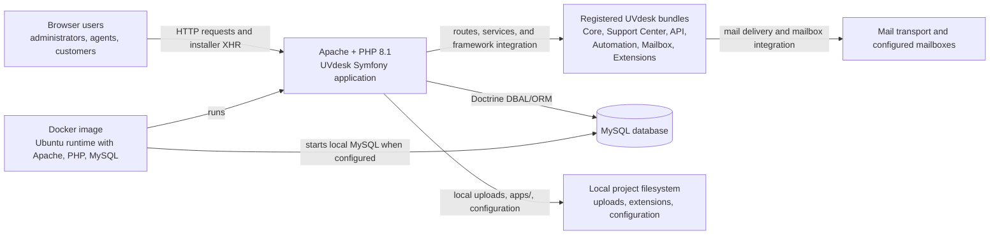
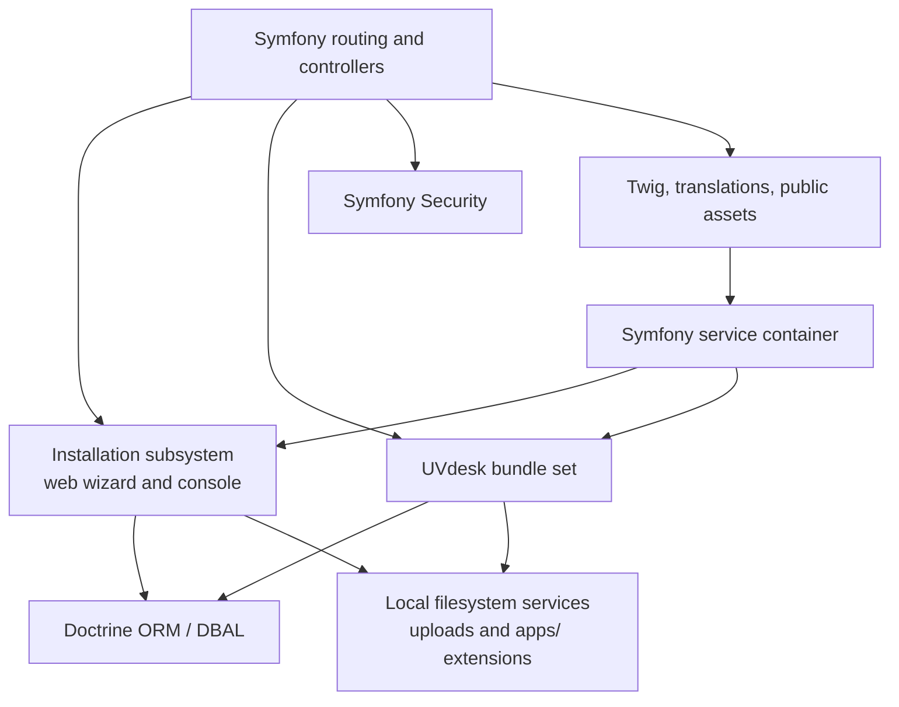

# Architecture Description

## 1. Document Title

**UVdesk Community Skeleton Technology Architecture**

This document describes the implemented architecture of the UVdesk Community Skeleton: a configurable PHP/Symfony application shell that assembles UVdesk helpdesk bundles, exposes web and installer interfaces, and provides configuration for security, persistence, mail, extensions, localization, and containerized execution.

## 2. Architecture Description Scope

### 2.1 System / Entity of Interest

The system is the `uvdesk/community-skeleton` project. It is a deployable composition layer for UVdesk Community rather than the complete implementation location of all helpdesk business behavior.

Its repository-level responsibilities include:

- Symfony application and service-container configuration.
- Registration and routing of UVdesk packages.
- A browser-based and console-based installation/configuration workflow.
- Security, database, mail, localization, template, upload, and extension configuration.
- Docker-based Apache/PHP/MySQL runtime scaffolding.
- Setup-facing templates, static assets, and translations.

### 2.2 Purpose of the Architecture Description

This description establishes the actual runtime components, technology boundaries, state mechanisms, external integration points, and deployment evidence represented by the repository. It separates the skeleton’s integration responsibilities from behavior delegated to installed UVdesk bundles.

### 2.3 Stakeholders

- **Helpdesk administrators** configuring and operating an installation.
- **Support agents** using protected member-facing functions.
- **Customers** using customer-facing functions where enabled by installed bundles.
- **API clients** accessing the `/api` firewall boundary through the UVdesk API bundle.
- **Extension developers and operators** supplying extensions under the configured application extension directory.
- **Deployment operators** running the application directly or using its Docker image.
- **Contributors** maintaining the skeleton and its configuration assets.

### 2.4 Stakeholder Concerns

| Stakeholder | Architectural concerns |
|---|---|
| Administrators | Installation, database setup, super-user creation, configurable site paths, mail configuration, and security boundaries |
| Agents and customers | Browser access, authentication, session behavior, translated UI, and role-based access |
| API clients | API authentication boundary and bundle-provided API behavior |
| Operators | PHP/Apache/MySQL runtime, Composer dependency installation, filesystem permissions, environment configuration, and logs |
| Extension developers | Extension discovery location and integration with the extension framework |
| Maintainers | Clear separation between the skeleton and independently maintained UVdesk bundles |

### 2.5 Architectural Scope and Boundaries

The repository directly establishes an application host that integrates these installed UVdesk bundles:

- Core Framework
- Automation Bundle
- Extension Framework
- Mailbox Bundle
- Support Center Bundle
- API Bundle

The core ticketing, automation-rule execution, mailbox parsing, customer-portal implementation, and API endpoint internals are largely implemented by those dependencies and are not available in this repository snapshot. This document therefore describes their registration and integration boundary, not their internal designs.

### 2.6 Architecture Principles / Constraints

- **Bundle composition:** Functional capabilities are assembled through Composer-managed Symfony bundles.
- **Configuration-led integration:** The repository’s primary implementation is Symfony and UVdesk configuration, installation logic, public assets, and deployment scaffolding.
- **Server-rendered web application:** Twig is configured as the template system; browser-side wizard code augments the installation UI.
- **Relational persistence:** Doctrine DBAL/ORM is configured for MySQL through `DATABASE_URL`.
- **Local filesystem integration:** The configured upload manager is local, and extension discovery uses a project-local `apps/` directory.
- **Environment-dependent deployment:** Secrets, session lifetime, database connection, and mail transport are supplied through environment-backed configuration.

## 3. Architecture Context

### 3.1 External Environment

The application is designed to run as a PHP web application behind Apache or another compatible web server. The included container build creates an Ubuntu-based image containing Apache, PHP 8.1 with relevant extensions, MySQL, Composer, and the project source.

The runtime connects to or hosts:

- A MySQL-compatible relational database.
- A configured mail transport and, optionally, configured IMAP and SMTP mailbox endpoints.
- Browser clients over HTTP in the supplied Apache configuration.
- Composer package sources during image build or application installation.

### 3.2 External Entities

| External entity | Relationship to the system |
|---|---|
| Browser users | Interact with installer, customer, and member-facing web interfaces |
| MySQL database | Stores Doctrine-managed application state |
| Mail transport | Receives outbound mail configuration through `MAILER_DSN` |
| Mailboxes | May be configured with IMAP settings for inbound processing and SMTP settings for outbound delivery |
| API consumers | Reach the `/api` security firewall and bundle-provided API surface |
| Extension packages | Are discovered from the local `apps/` directory through the extension framework |
| Composer repositories | Provide Symfony, UVdesk, and other PHP packages during dependency installation |

### 3.3 Context Relationships

The diagram represents the supported architectural relationships. Mail transport, mailbox credentials, and extension content are configuration-dependent; no specific provider, hosted service, or extension is hard-coded by the repository.

### 3.4 External Interfaces

| Interface | Architectural role |
|---|---|
| HTTP web interface | Apache serves the application from `/var/www/uvdesk/public`; Symfony routing handles dynamic application requests |
| Installer XHR endpoints | Browser-side wizard code invokes relative `/wizard/xhr/...` endpoints for prerequisite checks, database credential verification, configuration, schema migration, initial data population, super-user creation, and site-path configuration |
| Member-facing interface | Security configuration protects the configurable member path, defaulting to `member` |
| Customer-facing interface | Security configuration protects the configurable customer path, defaulting to `customer` |
| API interface | Requests under `/api` use the `uvdesk_api` firewall and the API bundle’s credentials provider and guard authenticator |
| Database interface | Doctrine uses `pdo_mysql`, configured for MySQL server version `5.7`, with a `DATABASE_URL` connection value |
| Mail interface | Symfony Mailer obtains the main transport from `MAILER_DSN`; the mailbox bundle has separate optional IMAP/SMTP mailbox configuration |
| Console interface | The README documents `php bin/console uvdesk:configure-helpdesk`; console wizard classes are present under `src/Console/Wizard` |

### 3.5 Business / Operational Context

The system is packaged as a customizable helpdesk installation. The skeleton centralizes deployment and configuration for the UVdesk ecosystem, while installed bundles provide support-center, mailbox, API, automation, extension, and core-framework capabilities. A user-facing installation wizard establishes the environment before normal operation.

## 4. Architecture Drivers

### 4.1 Business Drivers

- Deliver a deployable, customizable UVdesk Community helpdesk installation.
- Support both administrator/agent and customer-facing access paths.
- Allow organizations to integrate email-driven support communications.
- Permit platform extension through the UVdesk extension framework.
- Support installation by browser wizard or command line.

### 4.2 Functional Drivers

- Configure and verify database connectivity during installation.
- Create database schema and populate initial entities.
- Create an initial super-user.
- Configure member and customer URL prefixes.
- Protect member, customer, and API access through separate Symfony security boundaries.
- Provide localization and server-rendered presentation support.
- Make uploads and extensions available through local project directories.

### 4.3 Quality Attributes / Quality Concerns

| Concern | Architectural treatment |
|---|---|
| Customizability | Composer-installed UVdesk bundles, an `apps/` extension directory, and configuration-driven site paths |
| Deployability | Composer setup, a documented CLI configuration command, browser installer, and Docker image |
| Localization | Symfony Translation uses `translations/`, defaults to English, and falls back to English |
| Security | Symfony firewall and access-control configuration, role hierarchy, password encoder, remember-me support for the member area, and an API guard |
| Operational visibility | Apache access/error logs and PHP error logging are configured; application logging detail is not established by the inspected configuration |
| Data compatibility | Doctrine is configured for MySQL with `utf8mb4` and `utf8mb4_unicode_ci` defaults |
| Extensibility | UVdesk Extension Framework bundle registration and project-local extension discovery |
| File handling | Local upload-manager configuration and maximum upload/post parameters exposed to Twig templates |

### 4.4 Constraints

- The Composer manifest accepts PHP `^7.2.5 || ^8.0`; the supplied Docker image specifically installs PHP 8.1.
- Symfony Flex is configured with a Symfony `^5.4` requirement.
- The database configuration selects `pdo_mysql`, MySQL server version `5.7`, and `utf8mb4`.
- The container is Ubuntu-based and provisions Apache, PHP, MySQL, Composer, and required PHP extensions in one image.
- The installation requires writable project areas in the included container: `var`, `config`, `public`, `migrations`, and `.env`.
- The runtime depends on installed Composer packages; no lockfile-based resolved dependency topology is established here.

### 4.5 Regulatory / Compliance Drivers

No regulatory, privacy, retention, audit, residency, or compliance architecture is defined in the repository. Email, support data, credentials, and customer information are likely operationally sensitive, but data classification and compliance controls cannot be determined from the available implementation.

## 5. Architecture Overview

### 5.1 Architectural Style / Approach

The implementation is a **modular Symfony web application** with a **composition-oriented bundle architecture**:

1. Symfony supplies the dependency-injection container, routing, sessions, security, Twig integration, translation, mailer integration, and Doctrine integration.
2. Composer supplies the UVdesk bundles that provide major product capabilities.
3. The skeleton contributes configuration, installer controllers and console logic, static installer assets, translations, and container configuration.
4. Doctrine connects the application to MySQL persistence.
5. Apache exposes the public web root in the supplied Docker runtime.

The README characterizes the wider product as service-oriented and event-driven. This repository itself confirms bundle-based composition but does not expose event buses, asynchronous consumers, broker configuration, or service-to-service deployments. It should therefore be understood as a single application host rather than a verified microservice topology.

### 5.2 Major Architectural Decisions

| Decision | Implemented form and consequence |
|---|---|
| Use Symfony as the application foundation | Symfony Flex, Framework Bundle, Runtime, Security, Twig, Translation, Mailer, ORM, and related packages are declared; `config/services.yaml` autowires and autoconfigures application classes |
| Assemble UVdesk functionality as bundles | Six UVdesk bundles are registered for all environments in `config/bundles.php`, placing substantive product capabilities in installed dependencies |
| Use MySQL through Doctrine | Doctrine uses `pdo_mysql`, a `DATABASE_URL` connection, MySQL 5.7 compatibility, `utf8mb4`, and auto-mapping for local `App\Entity` classes |
| Provide interactive installation | Browser routes and JavaScript execute prerequisite checks and staged installation calls; console wizard classes and a documented console command provide a second installation path |
| Use server-rendered presentation | Twig templates are rooted at `templates/`; the setup UI is enhanced by browser-side JavaScript that uses jQuery, Backbone, and Underscore globals |
| Separate member, customer, and API access | Symfony security uses dedicated firewalls and role rules for member paths, customer paths, and `/api` |
| Support local extensions and uploads | Extensions are discovered from `apps/`; the UVdesk upload manager is configured as local filesystem-backed |
| Offer all-in-one container scaffolding | The Docker image combines Apache, PHP, MySQL, Composer, and application code rather than defining separate application and database containers |

No architecture-decision records or alternative analyses are maintained in the repository; the table describes implemented choices rather than a record of alternatives considered.

### 5.3 Major Building Blocks

| Building block | Responsibility and implementation |
|---|---|
| Apache/PHP web host | Serves the public directory and executes the PHP application. The Docker virtual host uses `/var/www/uvdesk/public` as document root and enables PHP 8.1 and rewrite support. |
| Symfony application shell | Provides framework configuration, routing, service registration, session support, security, Twig, translation, Doctrine, and mailer integration. Application classes under `src/` are autowired and autoconfigured. |
| UVdesk bundle set | Supplies core helpdesk platform, automation, mailbox, support center, API, and extension functionality. The bundles are registered in the Symfony application for all environments. |
| Installation subsystem | Includes browser-facing routes and installer code under `src/Controller/ConfigureHelpdesk.php` and console wizard classes. The setup UI posts staged configuration and migration actions to the application. |
| Doctrine/MySQL persistence | Uses the Doctrine DBAL/ORM integration and MySQL connection configuration. The installer exposes database credential validation and database migration steps. |
| Presentation and localization | Twig renders from `templates/`; translations are loaded from `translations/`. The configured locale set includes English, French, Italian, German, Danish, Arabic, Spanish, Turkish, Chinese, Polish, Hebrew, and Brazilian Portuguese. |
| Security subsystem | Uses Symfony Security roles, providers, form login, logout, remember-me, a customer firewall, and an API guard. |
| Mail and mailbox subsystem | Symfony Mailer receives a DSN-defined transport; the mailbox bundle accepts optional IMAP and SMTP settings. |
| Extension and filesystem subsystem | Loads extensions from `apps/` and configures the local upload manager. |
| Container runtime | Builds an Ubuntu image that installs Apache, MySQL, PHP 8.1, required PHP extensions, Composer, application code, and a custom entrypoint. |

### 5.4 Key Relationships

- Browser requests reach Apache, which serves the Symfony public web root.
- Symfony imports UVdesk and extension routes from the application root using custom `uvdesk` and `uvdesk_extensions` route types.
- The Symfony service container registers local classes from `src/` and injects them into controllers and other services.
- The active bundle set supplies routes, services, entities, security providers, and feature behavior beyond the skeleton’s own implementation.
- The installation UI sends HTTP POST and GET requests to installer routes, which coordinate configuration, database setup, migration, initial data loading, super-user creation, and path configuration.
- Doctrine connects the application to MySQL.
- Security dispatches member, customer, and API requests to their respective authentication mechanisms and access rules.
- Twig accesses application and UVdesk services exposed as global template variables.
- Mail delivery and mailbox processing are configured through environment and mailbox configuration; concrete provider endpoints are operator supplied.

### 5.5 Technology Strategy

The technology stack is PHP-centric and uses Composer for dependency management. Symfony provides the stable application framework, while UVdesk capabilities are versioned Composer dependencies. The project avoids a separate JavaScript build/package configuration in the inspected repository; installer JavaScript relies on browser-side libraries expected to be available to the page. Docker provides a ready-to-build runtime path, but does not define an orchestrated multi-container deployment.

## 6. Architecture Views and Models

### 6.1 Context View

**Viewpoint:** System context and external dependencies.  
**Purpose:** Show the application’s boundaries with browser users, database, mail systems, filesystem, and Docker runtime.  
**Stakeholder concerns addressed:** Access points, external dependencies, deployment responsibility, and persistence ownership.  
**Model / notation:** Mermaid flowchart in Section 3.3.  
**Model elements:** Browser users, Apache/PHP application, UVdesk bundles, MySQL database, mail systems, local filesystem, and Docker image.  
**Relationships:** Browser users access the application over HTTP; the application uses UVdesk bundles, Doctrine/MySQL, mail infrastructure, and local filesystem services. Docker runs the application and can start local MySQL.  
**Constraints / assumptions:** Mail transport, mailbox credentials, and extension content are configuration-dependent. No provider, hosted service, or extension is hard-coded.

The system is an HTTP web application whose principal external runtime relationships are a browser client, a MySQL database, mail infrastructure, and local filesystem directories. Docker can package the web application and local MySQL service together.

### 6.2 Functional / Capability View

**Viewpoint:** Major application capabilities.  
**Purpose:** Explain how the skeleton organizes functional concerns without attributing bundle internals to local code.  
**Stakeholder concerns addressed:** Functional ownership, customization, installation, and extension boundaries.  
**Model / notation:** Capability-to-owner table.  
**Relationships:** The skeleton provides installation and configuration capabilities while UVdesk bundles supply major helpdesk capabilities.  
**Constraints / assumptions:** Detailed operational behavior of installed bundles is outside this skeleton.

| Capability | Architectural owner |
|---|---|
| Helpdesk core behavior | UVdesk Core Framework bundle and related installed bundles |
| Customer support portal | UVdesk Support Center bundle |
| API support | UVdesk API bundle |
| Automation support | UVdesk Automation bundle |
| Mailbox integration | UVdesk Mailbox bundle |
| Extensions | UVdesk Extension Framework bundle and `apps/` directory |
| Installation and initial configuration | Local installer controllers, console wizard classes, routes, templates, and public assets |
| Image-cache endpoint | Local `ImageCacheController` route at `/tracker/xhr/get/cacheImage` |
| Localized presentation | Symfony Translation, Twig, translation catalogs, and public assets |

### 6.3 Logical / Building-Block View

**Viewpoint:** Internal application composition.  
**Purpose:** Identify meaningful implementation boundaries.  
**Stakeholder concerns addressed:** Component responsibilities and dependency boundaries.  
**Model / notation:** Mermaid flowchart.  
**Model elements:** Symfony routing/controllers, service container, installation subsystem, presentation layer, security, UVdesk bundles, Doctrine, and filesystem services.  
**Relationships:** Routing and service registration connect local installation logic and UVdesk bundles to persistence, security, presentation, and local filesystem services.  
**Constraints / assumptions:** The local source tree does not expose a complete local domain model; substantive helpdesk behavior arrives from registered UVdesk bundles.

The local source tree contains controller, console, service, routing, event-listener, migration, entity, and repository directories.

### 6.4 Runtime / Behavioral View

**Viewpoint:** Principal request and installation flows.  
**Purpose:** Explain synchronous runtime interactions that are implemented or explicitly configured.  
**Stakeholder concerns addressed:** Request handling, installation operations, authentication boundaries, and mail integration.  
**Model / notation:** Ordered request-flow and installation-flow descriptions.  
**Constraints / assumptions:** The repository does not establish asynchronous workers, event brokers, or mailbox invocation method.

#### Standard web request flow

1. A browser sends an HTTP request to Apache.
2. Apache uses `/var/www/uvdesk/public` as its document root in the supplied Docker configuration.
3. Symfony routing resolves local installer/image-cache routes or bundle-provided routes.
4. Symfony security selects a firewall based on the request path:
   - member path: configurable prefix, default `member`;
   - `/api`: API provider and API guard;
   - other paths: customer provider and form login flow.
5. Controllers and bundle services use injected services, Doctrine persistence, local filesystem services, mail configuration, and Twig as required.
6. Twig and the translation subsystem produce localized HTML responses for server-rendered interfaces.

#### Browser installation flow

1. Evaluate platform requirements through `POST /wizard/xhr/check-requirements`.
2. Submit and verify database credentials through `POST /wizard/xhr/verify-database-credentials`.
3. Store interim super-user details through `POST /wizard/xhr/intermediary/super-user`.
4. Obtain or update member/customer site prefixes using the website-configuration endpoint.
5. Apply configuration through `POST /wizard/xhr/load/configurations`.
6. Run schema migrations through `POST /wizard/xhr/load/migrations`.
7. Populate entities through `POST /wizard/xhr/load/entities`.
8. Create the default super-user through `POST /wizard/xhr/load/super-user`.
9. Apply final site-path configuration through `POST /wizard/xhr/load/website-configure`.

The local JavaScript validates website prefixes and administrator form fields before progressing. Server-side validation behavior is implemented in the controller but is not described at class-level here.

#### Email boundary

- Symfony Mailer configures its `main` transport from `MAILER_DSN`.
- The mailbox configuration permits named mailboxes with inbound IMAP settings and separate outbound SMTP settings.
- The member-path access-control list includes a mailbox listener route, which is accessible anonymously.

The repository does not establish whether mailbox intake runs by polling, webhook, cron, queue worker, or direct listener invocation.

### 6.5 Deployment / Physical View

**Viewpoint:** Containerized deployment implementation.  
**Purpose:** Explain the physical/runtime model supplied by the repository.  
**Stakeholder concerns addressed:** Runtime contents, initialization, local database behavior, and deployment gaps.  
**Model / notation:** Dockerfile, Apache virtual-host configuration, and entrypoint behavior.  
**Model elements:** Ubuntu image, Apache, PHP 8.1, MySQL, Composer, application files, entrypoint, and `uvdesk` user.  
**Relationships:** The Docker image contains and starts Apache and MySQL, serves the application through Apache, and conditionally initializes local MySQL.  
**Constraints / assumptions:** No `EXPOSE`, health check, Compose topology, Kubernetes resources, reverse proxy settings, persistent-volume declarations, or production process supervisor are defined.

The Dockerfile builds a single Ubuntu-based image containing:

- Apache 2.
- MySQL server.
- PHP 8.1 and Apache PHP module.
- PHP XML, IMAP, MySQL, mailparse, cURL, and common extensions.
- Composer.
- The application at `/var/www/uvdesk`.
- Custom Apache configuration and a custom entrypoint script.
- `gosu` to execute the supplied command as the non-root `uvdesk` user.

The container entrypoint:

1. Restarts Apache and MySQL.
2. Optionally initializes a local MySQL database and user when `MYSQL_USER`, `MYSQL_PASSWORD`, and `MYSQL_DATABASE` are set.
3. Sets a root password when the initialization branch executes.
4. Runs the container command as the `uvdesk` user.

The supplied Apache virtual host listens on port 80 and points at the application public directory. The container defaults to `/bin/bash`, so the repository does not by itself establish a foreground web-server command suitable for every container platform.

### 6.6 Data / Information View

**Viewpoint:** State ownership and storage mechanisms.  
**Purpose:** Identify what the repository establishes about application state.  
**Stakeholder concerns addressed:** Persistence, configuration state, sessions, files, extensions, and translation content.  
**Model / notation:** Data/state category table.  
**Constraints / assumptions:** There is no repository evidence of Redis, object storage, a queue broker, event store, search cluster, or dedicated cache service.

| Data / state category | Mechanism | Established behavior |
|---|---|---|
| Relational application data | Doctrine ORM/DBAL with MySQL | Database URL is environment-backed; local mappings may be auto-discovered from `src/Entity`; installer routes initiate schema migration and initial entity population |
| Installation configuration | Application configuration and environment-oriented files | The installer includes configuration-writing steps; container permissions grant write access to `config` and `.env` |
| Authentication/session state | Symfony native session storage | Sessions start only when accessed; secure cookie behavior is automatic, SameSite is `lax`, and lifetime derives from `UV_SESSION_COOKIE_LIFETIME` |
| Uploaded files | Local UVdesk upload manager | Storage is local to the application environment; a remote object store is not configured |
| Extensions | Local `apps/` directory | The extension framework scans a project-local path |
| Translation content | Files under `translations/` | English is default and fallback locale |
| Image cache | Local image-cache controller/service area | A tracker cache-image route is defined; cache storage strategy and retention are not established |

Doctrine configuration establishes MySQL as the intended primary persistent store.

### 6.7 Security View

**Viewpoint:** Identity, authorization, session, and trust boundaries.  
**Purpose:** Explain the security architecture configured by the project.  
**Stakeholder concerns addressed:** Authentication, role-based access, API access, sessions, and external trust boundaries.  
**Model / notation:** Symfony Security configuration, role hierarchy, firewalls, and access rules.  
**Constraints / assumptions:** The exact route handlers, identity-store schema, API credential format, CSRF behavior, password policy, MFA support, SSO integration, and authorization rules inside installed bundles are not established.

#### Authentication and authorization

The configured role hierarchy includes:

- `ROLE_AGENT`
- `ROLE_ADMIN`, inheriting agent access
- `ROLE_SUPER_ADMIN`, inheriting administrator access
- `ROLE_CUSTOMER`

The member-facing firewall uses the `user.provider` service, form login, logout, and a seven-day remember-me configuration. The customer firewall also uses the user provider and form login/logout. API requests under `/api` use `Webkul\UVDesk\ApiBundle\Providers\ApiCredentials` and the API bundle’s guard authenticator.

Access rules separate protected member functions from customer functions:

- Member login, account creation, password recovery, credential update, and mailbox listener routes have explicit access rules.
- The remainder of the member path requires `ROLE_AGENT`.
- Customer login, ticket creation, password recovery, and credential update have explicit access rules.
- Customer ticket viewing and customer-path access require customer-related roles.

#### Runtime trust boundaries

- **Browser-to-server boundary:** HTTP is configured in the supplied virtual host. TLS termination and HTTPS enforcement are not supplied.
- **Application-to-database boundary:** Credentials and endpoint are expected through `DATABASE_URL`.
- **Application-to-mail boundary:** Mail transport configuration is supplied through `MAILER_DSN`; mailbox credentials are configuration inputs.
- **Extension boundary:** Extensions are loaded from a writable project-local directory; isolation, signing, and permission restrictions are not established.
- **Container privilege boundary:** Startup begins with system-service operations and transitions command execution to the `uvdesk` user.

### 6.8 Other Stakeholder-Specific Views

#### Localization view

**Viewpoint:** Localization configuration.  
**Purpose:** Identify language and translation support.  
**Stakeholder concerns addressed:** Available locales and fallback behavior.  
**Model / notation:** Symfony Translation configuration.  
**Constraints / assumptions:** Layout direction handling and translation completeness are not established.

Symfony Translation is configured with:

- Default locale: `en`.
- Translation directory: `translations/`.
- Fallback locale: `en`.
- Configured application locale list: `en`, `fr`, `it`, `de`, `da`, `ar`, `es`, `tr`, `zh`, `pl`, `he`, and `pt_BR`.

The presence of Arabic and Hebrew catalogs shows language coverage beyond left-to-right languages.

#### Installation operations view

**Viewpoint:** Installation operations.  
**Purpose:** Describe the setup operational boundary.  
**Stakeholder concerns addressed:** Prerequisite verification, database configuration, initial state creation, and alternate installation channels.  
**Model / notation:** Browser installer workflow and documented console command.  
**Constraints / assumptions:** Equivalent setup is documented through a console command, but implementation details beyond the provided wizard classes are not established.

The installation subsystem allows an operator to verify runtime prerequisites, connect to a database, create initial state, establish a super-user, and set member/customer URL prefixes.

## 7. Architecture Decisions

### AD-01 — Symfony Application Host

- **Decision ID:** AD-01
- **Decision:** Use Symfony as the application runtime and integration framework.
- **Context:** The application needs routing, dependency injection, sessions, templates, translation, security, database access, mail integration, and console support.
- **Drivers:** Modular composition, PHP deployment compatibility, convention-based service registration, and availability of Symfony bundle integrations.
- **Alternatives considered:** Not represented in the repository.
- **Rationale:** Symfony Flex and the declared Symfony packages provide the application foundation; local classes are autowired and autoconfigured.
- **Consequences:** Runtime behavior depends substantially on Symfony configuration and Composer-installed packages.
- **Status:** Implemented.

### AD-02 — UVdesk Bundle Composition

- **Decision ID:** AD-02
- **Decision:** Register Core Framework, Automation, Extension Framework, Mailbox, Support Center, and API bundles in the application.
- **Context:** The skeleton is intended to deliver an integrated helpdesk platform without implementing every product function locally.
- **Drivers:** Product modularity, extension capability, and reuse of independently maintained UVdesk components.
- **Alternatives considered:** Not represented in the repository.
- **Rationale:** All six bundles are declared as Composer requirements and registered for all environments.
- **Consequences:** The skeleton is architecturally central but delegates most domain behavior to dependencies.
- **Status:** Implemented.

### AD-03 — MySQL Persistence Through Doctrine

- **Decision ID:** AD-03
- **Decision:** Use Doctrine DBAL/ORM with MySQL.
- **Context:** Installation and helpdesk application state require relational persistence.
- **Drivers:** ORM integration, UTF-8 support, database migration during setup, and MySQL runtime support in Docker.
- **Alternatives considered:** Not represented in the repository.
- **Rationale:** Doctrine is configured with `pdo_mysql`, MySQL 5.7 compatibility, `utf8mb4`, and a `DATABASE_URL`.
- **Consequences:** Database configuration and availability are prerequisites for a completed installation.
- **Status:** Implemented.

### AD-04 — Dual Installation Channels

- **Decision ID:** AD-04
- **Decision:** Provide both browser-wizard and console-based installation paths.
- **Context:** Operators may install the project from a web environment or terminal.
- **Drivers:** Usability, deployability, and staged validation/configuration.
- **Alternatives considered:** Not represented in the repository.
- **Rationale:** Installer routes, wizard browser assets, console wizard classes, and documented `uvdesk:configure-helpdesk` command are present.
- **Consequences:** Installation logic has both HTTP and CLI-facing operational surfaces.
- **Status:** Implemented.

### AD-05 — Local Filesystem for Uploads and Extensions

- **Decision ID:** AD-05
- **Decision:** Use local application directories for uploads and extension discovery.
- **Context:** The application needs file upload and extension mechanisms without a configured external storage service.
- **Drivers:** Simple deployment and local customizability.
- **Alternatives considered:** Not represented in the repository.
- **Rationale:** The UVdesk upload manager is configured as `Localhost`, and extensions use `%kernel.project_dir%/apps`.
- **Consequences:** Durable file and extension availability depends on filesystem persistence in the chosen deployment environment.
- **Status:** Implemented.

### AD-06 — All-in-One Docker Runtime

- **Decision ID:** AD-06
- **Decision:** Build Apache, PHP, MySQL, Composer, and application code into one Ubuntu-based Docker image.
- **Context:** The project provides a containerized deployment option.
- **Drivers:** Ease of initial setup and self-contained local runtime provisioning.
- **Alternatives considered:** Not represented in the repository.
- **Rationale:** The Dockerfile installs and starts Apache and MySQL in the same image and conditionally bootstraps local MySQL.
- **Consequences:** The container configuration does not define an independently scalable database tier or durable database storage arrangement.
- **Status:** Implemented as supplied deployment scaffolding.

## 8. Cross-Cutting Architecture Concepts

### 8.1 Security

Security is provided through Symfony Security configuration and UVdesk-provided user and API services. The implementation separates member, customer, API, and development-static-resource paths. The Symfony secret comes from `APP_SECRET`; session lifetime comes from `UV_SESSION_COOKIE_LIFETIME`.

The configuration comments out explicit `csrf_protection` at the framework level. Twig receives a CSRF token generator service, but the repository does not establish which forms are protected or whether a bundle enables CSRF behavior independently.

### 8.2 Error Handling

- PHP errors are configured to be logged.
- The browser installer displays client-side error messages for HTTP 404 and 500 conditions and disables progression on failed requests.
- Installer XHR failures are surfaced as setup errors in the UI.

Application-wide exception rendering, error-response formats, retry policies, and error-reporting integrations are not established.

### 8.3 Logging / Monitoring

The Apache virtual host writes access and error logs under Apache’s log directory. PHP error logging is enabled by framework configuration. The Composer manifest includes Symfony Monolog Bundle, but no application-level Monolog configuration was found in the inspected files. Metrics, tracing, alerting, health endpoints, and log aggregation are not defined.

### 8.4 Configuration

Configuration is divided across:

- Symfony package YAML under `config/packages/`.
- Service registration in `config/services.yaml`.
- Route imports in `config/routes.yaml`.
- Local installer routes in `src/Resources/config/routes.yaml`.
- Environment-backed values including `APP_SECRET`, `UV_SESSION_COOKIE_LIFETIME`, `DATABASE_URL`, and `MAILER_DSN`.
- UVdesk parameters for locales, URL prefixes, default ticket values, upload constraints, assets, and site URL.
- Optional mailbox and extension configuration.

An `.env.example` file is present, but its legacy-style keys such as `DB_*`, `MAIL_*`, `CACHE_DRIVER`, and `QUEUE_DRIVER` are not the same configuration keys consumed directly by the inspected Symfony database and mailer YAML. The authoritative deployment value mapping therefore requires reconciliation during installation or operator configuration; the repository does not show that mapping in the inspected files.

### 8.5 Data Management

Doctrine owns relational persistence integration. The local installer has explicit routes for credential verification, schema migration, and data population. The configured character set and collation are suitable for multilingual text storage. Entity definitions, migration files, table layout, retention, backups, and database transaction patterns are not represented in this repository snapshot.

### 8.6 Concurrency

The repository does not configure a message broker, worker supervisor, scheduler, queue consumer, or asynchronous job runner. The `.env.example` contains a legacy `QUEUE_DRIVER=sync` setting, but it is not linked to the inspected Symfony configuration and does not establish an active queue architecture.

### 8.7 Communication

The principal communication mechanisms are:

- Browser HTTP requests to Apache/Symfony.
- Browser AJAX requests during installation.
- In-process Symfony service calls and bundle integration.
- Database connections through Doctrine DBAL.
- Mail transport connections through Symfony Mailer.
- Optional IMAP/SMTP connections through mailbox configuration.

No internal network service calls, REST client use, event broker, webhook configuration, or inter-service protocol is established by this repository.

### 8.8 Resilience / Fault Tolerance

The repository contains basic installer failure handling and database connection checks. It does not define high availability, clustering, replication, retries, circuit breakers, backup/restore processes, disaster recovery, queue durability, or load balancing. Container restart behavior, persistent data volumes, and production database management remain deployment responsibilities outside the supplied implementation.

### 8.9 Deployment / Operations

The repository supports direct Composer-based setup and Docker image construction. The Dockerfile configures filesystem permissions for mutable application directories and runs a cache-clear command during image build, tolerating failure for that command. The project does not include Compose, Kubernetes manifests, CI deployment workflows, or environment-specific infrastructure definitions.

## 9. Technology Architecture

### 9.1 Technology Choices

| Technology | Role | Version evidence |
|---|---|---|
| PHP | Application runtime | Composer permits `^7.2.5 || ^8.0`; Docker installs PHP 8.1 |
| Symfony | Framework, DI, routing, security, templates, translation, mail, ORM integration, runtime | Symfony Flex requires Symfony `^5.4`; individual Symfony component versions resolve through Composer/Flex |
| Composer | Dependency installation and autoloading | Composer 2 or higher is documented as a requirement; Docker installs Composer during build |
| UVdesk bundles | Helpdesk platform capability modules | Core `^1.1.7`; Automation `^1.1.4`; Extension Framework `^1.1.2`; Mailbox `^1.1.5`; Support Center `^1.1.3`; API `^1.1.4` |
| Doctrine | Relational persistence integration | Symfony ORM Pack is declared; concrete resolved Doctrine package version is not available |
| MySQL | Primary relational database | Doctrine configuration targets MySQL 5.7 compatibility; Docker installs the Ubuntu-provided MySQL server package |
| Twig | Server-side template rendering | Twig `^2.12|^3.0` and Twig bundle are declared |
| Symfony Mailer | Mail transport abstraction | Declared and configured through `MAILER_DSN` |
| Apache HTTP Server | Web server in Docker runtime | Apache 2 package installed in Docker image |
| JavaScript with jQuery, Backbone, Underscore | Browser installer UI behavior | Wizard source uses these browser globals; package/loading details are not established |
| Docker | Container build/runtime packaging | Top-level Dockerfile and `.docker/` configuration are supplied |

### 9.2 Platforms / Runtime

- Ubuntu base image in the supplied Dockerfile.
- Apache 2 with PHP 8.1 module and rewrite module enabled.
- PHP extensions include XML, IMAP, MySQL, mailparse, and cURL, supporting the configured database and mailbox-oriented application boundary.
- Application working directory: `/var/www/uvdesk`.
- Apache document root: `/var/www/uvdesk/public`.
- Application runtime user in the image: `uvdesk`.

### 9.3 Frameworks / Libraries

Architecturally material libraries include Symfony Framework, Runtime, Security, Twig, Translation, Mailer, Doctrine ORM integration, the UVdesk bundles, Intervention Image/Imagecache, and Google reCAPTCHA. The Composer manifest establishes these as declared dependencies, while bundle registration and configuration establish active application integration for Symfony and UVdesk components.

Other declared packages are not separately modeled because their precise runtime use is not necessary to explain the application topology.

### 9.4 Infrastructure

The repository’s infrastructure definition is limited to a Docker image and Apache/PHP configuration. It does not define external managed services, an ingress controller, DNS, TLS certificates, secrets manager, network policies, or persistent storage resources.

### 9.5 External Services

The architecture supports operator-provided external services rather than naming a fixed vendor:

- MySQL database server through `DATABASE_URL`.
- Mail transport through `MAILER_DSN`.
- Optional IMAP and SMTP mailbox services.
- Composer repositories during dependency installation.

The README references an AWS Marketplace AMI, external documentation, and hosted UVdesk resources; these references do not establish a runtime dependency for a locally deployed application.

### 9.6 Technology Constraints

- MySQL-specific Doctrine configuration limits the configured persistence path to MySQL-compatible connectivity.
- The local filesystem upload and extension model requires durable writable storage when deployed in ephemeral environments.
- The Docker image combines database and web runtime responsibilities, which is a materially different operational shape from a separately managed database deployment.
- The database server version expected by Doctrine configuration is 5.7, while the Dockerfile installs an unpinned Ubuntu package; compatibility must be managed by the deploying environment.
- The version-resolved dependency set cannot be determined without a Composer lockfile or installation output.

## 10. Architecture Evaluation

### 10.1 Quality Attribute Analysis

| Quality attribute | Current architectural support | Limitation |
|---|---|---|
| Modularity | UVdesk capabilities are separated into registered Composer bundles | Bundle internals and version-resolved compatibility are outside this repository |
| Customization | Configurable site paths, mailboxes, translations, Twig templates, local extensions, and local uploads | Configuration lifecycle and extension isolation are not fully visible |
| Installability | Browser wizard, console configuration command, Composer installation, and Docker support | Production installation automation and deployment orchestration are not included |
| Internationalization | Translation directory, broad locale list, English default/fallback | Locale negotiation, translation coverage, and RTL presentation are not established |
| Security segregation | Dedicated member, customer, API, and development firewalls/access rules | TLS, MFA, SSO, audit logging, and password/credential lifecycle are not established |
| Persistence | Doctrine/MySQL configuration and installer-driven migration process | Schema, backups, high availability, and data-retention policies are not present |
| Operability | Apache/PHP error logging and web-server logs | Monitoring, tracing, metrics, health checks, and centralized logging are absent from repository evidence |

### 10.2 Trade-offs

- Bundle composition reduces locally maintained business logic but makes runtime behavior and compatibility dependent on external package implementations.
- An all-in-one Docker image simplifies initial setup but couples web-server and database lifecycle within a single runtime image.
- Local upload and extension directories simplify customization but make persistent filesystem management operationally important.
- Browser installation improves accessibility for administrators but creates sensitive setup operations that must be protected appropriately in deployed environments.

### 10.3 Risks

- The Docker image uses `ubuntu:latest` and installs system packages without image-version pinning, reducing build reproducibility.
- The Docker configuration installs database and web runtime in the same image but does not define persistent data volumes or backup behavior.
- The container default command is `/bin/bash`; a deployment platform may require an explicit foreground process command.
- The MySQL version declared for Doctrine compatibility and the version delivered by an unpinned operating-system package may diverge.
- Extension loading from a local project directory has no repository-defined signing, isolation, or lifecycle controls.
- The relationship between the checked-in `.env.example` keys and the Symfony configuration’s expected environment keys is not directly established.
- No configured external cache, queue, worker, or scheduler is available for workloads that may require background processing in dependent bundles.

### 10.4 Technical Debt

The repository does not identify technical debt explicitly. The following implementation limitations are visible:

- Deployment topology is limited to a single-image Docker build rather than declarative multi-service infrastructure.
- Operations configuration does not include health checks, observability integration, or persistence declarations.
- The container build has broad write permissions on multiple application directories.
- The runtime command and service supervision model are incomplete for a generic production container environment.
- Dependency resolution is not reproducible from the repository evidence because no Composer lockfile is available.

### 10.5 Open Issues

- Which resolved versions of Symfony, Doctrine, and transitive packages are installed in a real deployment?
- How does installation transform legacy-style `.env.example` settings into Symfony `DATABASE_URL` and `MAILER_DSN` values, if it does?
- What database schema, migrations, and data-retention obligations are implemented by the installed UVdesk bundles?
- How are inbound mailboxes invoked and processed operationally?
- Do any dependent bundles require workers, queues, scheduled commands, cache stores, or additional external services?
- What is the intended production command/process model for the provided Docker image?
- How are TLS, reverse-proxy headers, secrets, backups, and persistent upload/extension storage managed in production?
- Which routes and API operations are contributed by the registered bundles?

## 11. Architecture Evolution

### 11.1 Current State

The current implementation is a Symfony 5.4-oriented, Composer-composed UVdesk application skeleton. It integrates registered UVdesk bundles, MySQL persistence, Twig presentation, localized resources, Symfony security, mail/mailbox configuration, local extension discovery, and a browser/console installation subsystem. Docker provides an all-in-one Apache/PHP/MySQL runtime option.

### 11.2 Target State

No repository-defined target architecture is available. Documentation describes the skeleton as a basis for building and customizing helpdesk solutions, but it does not prescribe a future deployment topology, persistence strategy, or decomposition into separate runtime services.

### 11.3 Evolution Drivers

The repository structure indicates likely evolution through:

- Composer upgrades to Symfony and UVdesk bundle versions.
- Application-specific extensions in `apps/`.
- Configuration changes for mailboxes, site paths, localization, database connectivity, and upload limits.
- Custom Twig templates and public assets.
- Deployment changes outside the repository’s supplied single-container scaffolding.

### 11.4 Transition Considerations

Any evolution must account for:

- Composer package compatibility across PHP, Symfony, UVdesk bundles, and Doctrine.
- Database migration execution and backup planning.
- Preservation of local uploaded files and extensions.
- Compatibility of MySQL versions with Doctrine configuration.
- Security implications of changing member/customer paths, API access, mail credentials, or extension packages.
- Container runtime behavior and externalization of state when moving from the supplied all-in-one image to another deployment model.

## 12. Glossary and References

| Term | Meaning |
|---|---|
| UVdesk Community Skeleton | The repository’s Symfony application shell for assembling and configuring a UVdesk Community helpdesk installation |
| Symfony bundle | A packaged Symfony module that contributes services, configuration, routes, and application features |
| Core Framework | Registered UVdesk bundle providing core platform capabilities |
| Support Center | Registered UVdesk bundle associated with customer-facing support-center capability |
| Mailbox Bundle | Registered UVdesk bundle configured for mailbox-related mail integration |
| Automation Bundle | Registered UVdesk bundle associated with automation capabilities |
| Extension Framework | Registered UVdesk bundle used with the project-local `apps/` extension directory |
| API Bundle | Registered UVdesk bundle providing API-specific providers and guard authentication |
| Doctrine | PHP persistence framework configured here for MySQL DBAL/ORM access |
| Twig | Server-side PHP template engine used for rendered HTML |
| `DATABASE_URL` | Environment-backed Doctrine database connection configuration |
| `MAILER_DSN` | Environment-backed Symfony Mailer transport configuration |
| Member path | Configurable protected staff/agent path; default `member` |
| Customer path | Configurable customer-facing path; default `customer` |
