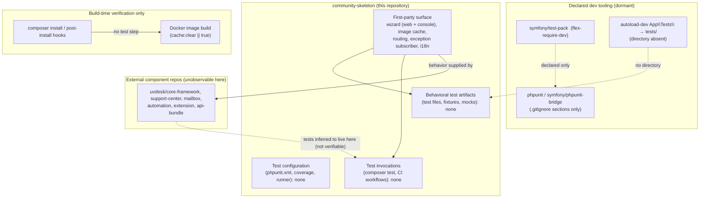

# Software Test Documentation

**Project:** UVdesk Community Skeleton (`uvdesk/community-skeleton`)
**Repository revision under analysis:** current cloned revision (78 tracked files)

## 1. Document Title

**Testing Harness Reconstruction — UVdesk Community Skeleton**

This document reconstructs how the repository verifies its own behavior. The central, evidence-backed finding is that **the repository contains no automated test suite, no test harness configuration, and no CI execution path**. The skeleton is a Composer-distributed integration point that assembles independently maintained UVdesk component bundles (core framework, support center, mailbox, automation, extension, and API bundles); those components live in separate repositories and are not observable from this repository. All automated-testing claims made in this document are therefore either (a) verified facts about the absence of test infrastructure in this repository, or (b) clearly labeled inferences about where testing is expected to occur, based on the documented multi-repository architecture.

## 2. Test Documentation Overview

### 2.1 Purpose

The purpose of this document is to describe the testing strategy, harness, fixtures, execution paths, and verification coverage that actually exist in the UVdesk Community Skeleton repository. Because the repository is a skeleton/distribution package rather than a feature-implementing codebase, the document also maps the repository's first-party executable surface (primarily the installation wizard and console configuration commands) to the verification evidence available for it.

### 2.2 Scope

**In scope:**

- Inventory of all test artifacts, test configuration, and test-related tooling in the repository (verified: none exist as runnable artifacts).
- Analysis of dependency declarations that imply a testing toolchain (`symfony/test-pack`, PHPUnit `.gitignore` sections, `autoload-dev` test namespace).
- Analysis of the Docker build path and GitHub community-process files as the repository's observable verification mechanisms.
- Identification of the first-party code surface that would require testing and the verification status of each area.
- External integration boundaries (database, mail, image processing, extensions) and how they are (not) tested from this repository.

**Out of scope:**

- Testing of the UVdesk component bundles (`uvdesk/core-framework`, `uvdesk/support-center-bundle`, `uvdesk/mailbox-component`, `uvdesk/automation-bundle`, `uvdesk/extension-framework`, `uvdesk/api-bundle`), which are separate repositories and are not present as source in this skeleton.

### 2.3 Test Objectives

No test objectives are formally defined anywhere in the repository. The following objectives are reconstructed from the repository's nature as a distributable application skeleton:

- **Installability verification** — the first-run installation wizard (`src/Controller/ConfigureHelpdesk.php`, `src/Console/Wizard/*`, `public/scripts/wizard.js`, `templates/installation-wizard/index.html.twig`) is the only first-party behavior with user-visible consequences; a smoke-level verification of wizard succeeds, environment checks, and database migration would be the natural objective. No such verification exists in the repository.
- **Packaging/build verification** — Composer install/update hooks and the Docker build are the only automated build/verification steps present (see §8).
- **Regression control** — handled at the process level only through changelogs and issue templates (see §9); no automated regression tests exist.

### 2.4 Test Items

The following first-party items constitute the testable surface of this repository. None of them has any associated automated test.

| Test item | Location | Description | Test evidence in repo |
|---|---|---|---|
| Installation wizard (web flow) | `src/Controller/ConfigureHelpdesk.php`, `templates/installation-wizard/index.html.twig`, `public/scripts/wizard.js`, `public/css/wizard.css` | Browser-based first-run configuration: system requirement evaluation, configuration XHR, schema migration XHR, entity population XHR | None |
| Installation wizard (console flow) | `src/Console/Wizard/ConfigureHelpdesk.php`, `src/Console/Wizard/DefaultUser.php`, `src/Console/Wizard/MigrateDatabase.php` | CLI-based configuration, interactive user prompts, database migration | None |
| Image cache | `src/Controller/ImageCache/ImageCacheController.php`, `src/Controller/ImageCache/ImageManager.php`, `src/Service/UrlImageCacheService.php` | URL-sourced image caching and serving | None |
| Routing resource | `src/Routing/RoutingResource.php`, `config/routes.yaml`, `src/Resources/config/routes.yaml` | Application and bundle route registration | None |
| Exception handling | `src/EventListener/ExceptionSubscriber.php` | Global exception subscriber | None |
| i18n resources | `translations/messages.*.yml` (12 locales) | Translation catalogs | None (no translation-quality or key-consistency checks) |
| Packaging / deployment | `composer.json`, `Dockerfile`, `.docker/*`, `.env.example` | Distribution, container image, runtime configuration | Build-time verification only (see §4, §8) |

### 2.5 References

- `composer.json` — dependency manifest, dev-dependency declarations, Composer scripts
- `.gitignore` — generated PHPUnit ignore sections (evidence of expected toolchain)
- `README.md` — project identity, installation and runtime instructions (no testing section)
- `.github/CONTRIBUTING.md` — contribution process (no testing instructions)
- `.github/PULL_REQUEST_TEMPLATE.md` — PR expectations (no testing checklist)
- `.github/ISSUE_TEMPLATE/Bug_report.md` — bug intake process
- `.github/SECURITY.md` — vulnerability disclosure process
- `CHANGELOG-1.0.md`, `CHANGELOG-1.1.md`, `CHANGELOG-1.2.md` — release-level change records
- `INSTALLATION GUIDE.md`, `.docker/config/php/php.ini`, `.docker/config/apache2/*` — deployment guidance

### 2.6 Definitions / Acronyms

- **Skeleton** — the `community-skeleton` distribution package; the Composer project that assembles UVdesk bundles into a runnable helpdesk application.
- **Bundle / component** — a separately versioned UVdesk repository (`core-framework`, `support-center-bundle`, `mailbox-component`, `automation-bundle`, `extension-framework`, `api-bundle`) installed as a composition dependency.
- **First-party code** — source files physically present in this repository (`src/`, `public/`, `config/`, `templates/`, `translations/`).
- **Flex** — the `symfony/flex` Composer plugin that resolves the project's `flex-require` / `flex-require-dev` package groups.

## 3. Test Strategy

### 3.1 Test Approach

**Verified reconstruction of the actual approach:**

1. **No automated tests exist in this repository.** A complete inventory of the 78 repository files shows: zero test files, zero test directories (`tests/`, `spec/`, `features/`), zero fixture/mock/stub artifacts, zero coverage configuration, zero PHPUnit or other runner configuration (`phpunit.xml`, `phpunit.xml.dist`), and zero CI workflow definitions (`.github/workflows/` is absent; no Travis, Circle, or other CI config). The Composer `scripts` section defines only `cache:clear` and `assets:install` as post-install/post-update hooks — there is no `test`, `lint`, `static-analysis`, or `coverage` script.
2. **The dependency manifest is test-aware but the repository is not.** `composer.json` declares `flex-require-dev` entries including `symfony/test-pack` (the Symfony testing package; transitively associated with PHPUnit tooling) and `autoload-dev` maps the `App\Tests\` namespace to a `tests/` directory — which does not exist in this repository. The root `.gitignore` contains machine-generated sections titled `###> symfony/phpunit-bridge ###` and `###> phpunit/phpunit ###` that ignore `/phpunit.xml` and `.phpunit.result.cache`. Together these prove that PHPUnit-based testing is the *expected* toolchain convention for this project family, but the skeleton ships with no test configuration, no test sources, and no test command.
3. **The repository's only automated build-time verification is the Docker image build** (`Dockerfile`: `composer install`, `composer dump-autoload --optimize`, `php bin/console cache:clear --env=prod --no-debug || true`). This verifies dependency resolution and basic console-binary availability, not behavior.
4. **Process-level verification is the observable quality mechanism.** Structured bug reports (environment, preconditions, reproduction steps, expected vs. actual results), a PR template, a security policy, and sequential changelogs (1.0 → 1.1 → 1.2) constitute a contribution-quality and release-discipline process. These are manual/process controls, not executable verification.

**Inferred structural approach (clearly labeled inference):** The README and CONTRIBUTING point to separate repositories for core framework, support center, mailbox, automation, and extension bundles, and CONTRIBUTING instructs contributors to target fixes to the respective bundle repository. It is therefore reasonable to infer that automated tests for domain behavior (tickets, mailboxes, automations, extensions) are maintained in those component repositories and are not part of this distribution skeleton. **This test strategy cannot be observed from this repository** and is reported as inference only.

### 3.2 Test Levels

No test levels are implemented or configured in this repository. The following table records the levels that would conventionally apply to the first-party surface and their actual status:

| Test level | Applicable first-party item | Status in repository |
|---|---|---|
| Unit | Console wizard command classes, image-cache service, routing resource | Not present; no test sources or runner config |
| Component / integration | Installation wizard controller (`ConfigureHelpdesk`), migrations, repository/entity wiring | Not present |
| End-to-end / system | Web installer through a running server; `php bin/console uvdesk:configure-helpdesk` CLI walkthrough | Not present |
| Packaging / build smoke | Docker image build, Composer install | **Present as build-time steps only** (`Dockerfile`); behavioral assertions absent |
| Security / contract / performance / load / UI | Any | Not present |

### 3.3 Test Types

No test types (functional, regression, API, authorization, usability, performance, security, compatibility, localization) are implemented as automated checks in this repository. Localization resources (12 translation catalogs) have no key-consistency or placeholder-validation check. Functional, regression, and security verification exist only as process conventions: bug-report reproduction steps, changelog records, and a responsible-disclosure security policy.

### 3.4 Test Techniques

No test design techniques are evidenced (no equivalence partitioning, boundary-value, state-transition, or scenario specifications exist). The only structured, behavior-describing artifact is the bug-report template, which prescribes reproduction steps and expected-versus-actual comparison — a manual equivalent of scenario-based testing performed by reporters and maintainers, not by an automated harness.

### 3.5 Test Completion Criteria

No completion criteria are defined. There are no coverage thresholds, no pass/fail gates, no exit criteria, and no quality gates anywhere in the repository (no CI status checks exist). The only gate-like mechanisms are process-level: Composer post-install scripts must execute without error for dependency installation to succeed, and the Docker `cache:clear` step tolerates failure (`|| true`), so even that is not a hard gate.

### 3.6 Test Suspension / Resumption Criteria

None defined. No test execution infrastructure exists against which suspension or resumption could apply.

## 4. Test Environment

### 4.1 Hardware

No hardware requirements for testing are documented. The README's hardware requirements (4 GB RAM, 1 GHz processor, Ubuntu 16.04 LTS+ or Windows 7+ / WAMP/XAMPP, Apache 2 or NGINX, PHP 8.1, MySQL 5.7.23+, Composer 2+) are **runtime** requirements for running the helpdesk, not a test environment specification.

### 4.2 Software

- **Runtime stack (per `composer.json`, README, Dockerfile):** PHP 8.x, Symfony (the `community-skeleton` requires `symfony/flex ^1.17|^2` and is composed on Symfony 5.4+ per `extra.symfony.require`), MySQL, Apache 2, Composer, PHP IMAP and PHP Mailparse extensions.
- **Test toolchain declared but unconfigured:** `symfony/test-pack` (under `flex-require-dev`); PHPUnit-related ignore entries for `phpunit.xml` and `.phpunit.result.cache` in `.gitignore`. No PHPUnit binary invocation, bootstrap, or configuration file exists in the repository, so the toolchain cannot be executed from this repository without external setup.
- **Container environment:** `Dockerfile` builds an Ubuntu-based image (Apache 2 + PHP 8.1, MySQL server, IMAP, Mailparse, GOSU, Composer). The image installs project dependencies but executes no tests.

### 4.3 Network / Infrastructure

None specifically for testing. The `.env.example` mail settings point at `smtp.mailtrap.io` (port 2525, TLS), which is a sandbox SMTP service — configuration evidence that outbound-mail development/testing was intended to use a sandbox relay, but no automated test exercises mail sending. The README's Packagist and shield badges are project-marketing/community indicators; there is no CI status badge.

### 4.4 Test Data

No test data exists. There are no fixtures, factories, seed data, or database dumps. `.env.example` provides an empty-database configuration (`DB_DATABASE=`, `DB_USERNAME=`, `DB_PASSWORD=` with `DB_CONNECTION=mysql`) suitable for manual setup, and dev-mode simplifications (`QUEUE_DRIVER=sync`, `CACHE_DRIVER=file`, `SESSION_DRIVER=file`) that remove background-worker and external-cache dependencies during local running. These are developer-experience settings, not test data.

### 4.5 Environment Configuration

`.env.example` defines `APP_ENV=local` (no `test` environment profile), mail, database, cache, session, queue, and logging settings. No environment configuration is dedicated to test execution, and no test-specific secrets or databases are defined.

### 4.6 Tools

| Tool | Declared? | Configured? | Executed? |
|---|---|---|---|
| PHPUnit (`phpunit/phpunit`, `symfony/phpunit-bridge`) | Implied via dev-dependency tree and `.gitignore` sections | No (`phpunit.xml` absent) | No |
| `symfony/test-pack` | `flex-require-dev` in `composer.json` | No | No |
| Symfony console (`bin/console`) | Implied by README commands (`server:run`, `c:c`, `uvdesk:configure-helpdesk`) | Yes (runtime tool) | Runtime/manual only; no test invocation |
| GNU Make / task runner | No file present (`Makefile` absent) | — | — |
| Coverage tooling | None | None | None |
| Static analysis / linting | `phpstan/phpdoc-parser` present as a **runtime** dependency of framework packages (not a project lint gate); no PHPCS, PHPStan, or linter configuration | None | None |
| CI service | None (no `.github/workflows/`, no Travis/Circle config) | — | — |

## 5. Test Organization and Responsibilities

### 5.1 Roles

No testing roles are defined. The contribution model (`CONTRIBUTING.md`) defines only: bug reporters (issue templates), code contributors (fork + branch `issue-<id>` + PR to the matching repository), and maintainers (processing PRs/issues). No role is assigned the responsibility of authoring or running tests in this repository.

### 5.2 Responsibilities

Documented responsibilities are contribution-process responsibilities: verify a bug is not already reported, reproduce against a general configuration rather than a personal setup, separate fixes into issue-named branches, follow the PR template, and route PRs to the correct component repository. No responsibility for test authorship, test execution, or coverage maintenance is documented.

### 5.3 Independence / Review

No separation of testing from development is evidenced. There are no code-review checklists that reference tests, no PR template section covering testing (the template asks only *why*, *what*, and *linked issues*), and no "requires test" gate.

## 6. Test Conditions

No test conditions are formally defined in the repository (there is no requirements-to-test matrix). The table below reconstructs the candidate conditions for the first-party executable surface and records their verification status. The "No automated test evidence" status is the verified fact for every condition; there is no in-repository harness that could exercise any of them.

| Condition ID | Source behavior (repository evidence) | Condition description | Priority | Applicable level | Verification status |
|---|---|---|---|---|---|
| TC-01 | `ConfigureHelpdesk::evaluateSystemRequirements` (wizard) | Correct system-requirement checks with pass/fail feedback | High | Integration/e2e | No automated test evidence |
| TC-02 | `ConfigureHelpdesk::updateConfigurationsXHR` (wizard) | Configuration writes (env/config) persist and take effect | High | Integration | No automated test evidence |
| TC-03 | `ConfigureHelpdesk::migrateDatabaseSchemaXHR` / `Migrations` | Database schema migration succeeds on a target DB (MySQL) | High | Integration | No automated test evidence |
| TC-04 | `ConfigureHelpdesk::populateDatabaseEntitiesXHR` / `Console::Wizard` | Initial entities (default user) are created with validated input/interactive prompts | High | Integration | No automated test evidence |
| TC-05 | `Console::Wizard::DefaultUser` | Interactive email/password prompting and validation (CLI) | Medium | Unit/component | No automated test evidence |
| TC-06 | `ImageCache` controller + `UrlImageCacheService` | URL-sourced image retrieval, caching, and cache invalidation | Medium | Unit/component | No automated test evidence |
| TC-07 | `RoutingResource` + `routes.yaml` (app + bundle) | Route resource registration is valid and complete | Medium | Component | No automated test evidence |
| TC-08 | `ExceptionSubscriber` | Unhandled exceptions are captured and rendered (error template) | Medium | Component | No automated test evidence |
| TC-09 | `translations/messages.*.yml` (12 locales) | Key sets consistent across locales; placeholders valid | Medium | Static/unit | No automated test evidence |
| TC-10 | `composer.json` scripts (post-install hooks) | `cache:clear` / `assets:install` execute successfully after install | High | Build smoke | Executed by Composer install; **no assertions beyond non-zero exit** |
| TC-11 | `Dockerfile` build | Image builds, dependencies install, console command starts | High | Build smoke | Executed during image build; **no behavioral assertions** |

## 7. Test Cases / Test Procedures

No test cases or test procedures are defined, documented, or executable in this repository. This includes automated cases (none exist), manual test scripts (none exist), and documented installation verification steps (the README's "run the project and open the wizard in the browser" instructions describe first-run usage, not a test procedure with expected results and pass/fail criteria). Consequently, there are no preconditions, input specifications, test data definitions, expected results, pass/fail criteria, or postconditions to record.

## 8. Test Automation

### 8.1 Automated Test Scope

The automated scope is limited to **build and packaging automation**; there is no automated test scope in the behavioral sense.

- **Composer scripts** (`composer.json → scripts`): only `cache:clear` and `assets:install`, wired as `post-install-cmd` / `post-update-cmd`. These are lifecycle hooks that prepare the application; they do not assert behavior.
- **Docker build** (`Dockerfile`): executes `composer install`, `composer dump-autoload --optimize`, and `php bin/console cache:clear --env=prod --no-debug || true`. The final command explicitly tolerates failure (`|| true`), confirming that even the strongest build-time check is not a hard verification gate. No test execution occurs in the image build.
- **Docker entrypoint** (`.docker/bash/uvdesk-entrypoint.sh`): no test invocation is present in the repository; a repository-wide search for test-related terms found no references in Docker or GitHub directories.

### 8.2 Automation Frameworks

No automation framework is active. PHPUnit is the identifiable *intended* framework from circumstantial evidence — the `symfony/phpunit-bridge` and `phpunit/phpunit` sections in the root `.gitignore` indicate those packages contribute ignore rules to projects that install them, and `symfony/test-pack` under `flex-require-dev` is the corresponding developer tooling group. However, "intended toolchain" is not "active harness": there is no PHPUnit configuration, no bootstrap, no test source, and no invocation command in this repository. For the web/UI layer there is no Selenium/Playwright/Cypress (or equivalent) evidence at all.

### 8.3 Test Execution

There is no way to execute a test suite from this repository: no `composer test`, no Makefile target, no PHPUnit config file, no test directory, and no documented command. The only CI-adjacent execution is the Docker build (see §8.1), which does not run tests.

### 8.4 Automated Reporting

None. No test report formats, JUnit/XML outputs, or result dashboards are configured (the `.phpunit.result.cache` ignore entry implies the toolchain could produce such artifacts, but nothing generates or consumes them here).

### 8.5 CI Integration

**No CI integration exists.** There is no `.github/workflows/` directory, no Travis/Circle/GitLab configuration, no status checks, and no badge referencing a CI service in the README (the README badges cover Packagist version/downloads, Open Collective, Gitter, forums, Twitter, YouTube, and "Made in India" — none are CI status badges). The assertion that "CI runs tests" is therefore **not supported** for this repository.

The following diagram summarizes the reconstructed verification reality:

## 9. Defect / Incident Management

### 9.1 Defect Classification

No formal defect classification scheme exists. The bug-report template distinguishes *issue description*, *preconditions/environment* (framework version, commit id), *steps to reproduce*, *expected result*, and *actual result* — a structured narrative, not a classified taxonomy.

### 9.2 Severity / Priority

No severity or priority scheme is defined. Issue templates are limited to three categories: bug report, feature request, and support question.

### 9.3 Defect Lifecycle

A defect lifecycle is implicit in the GitHub process: report against `community-skeleton` or the appropriate component repository → verify not already reported → fix on an issue-named branch (e.g., `issue-1456`) with a `Fixed #1456 - <subject>` commit message → PR to the matching repository following the PR template. This is contribution-process documentation; no triage, assignment, or closure-state machine is documented.

### 9.4 Retest / Regression

No automated regression path exists. Regression management is manual and release-level: `CHANGELOG-1.0.md`, `CHANGELOG-1.1.md`, and `CHANGELOG-1.2.md` record changes across releases and would be the reference point for human regression checking. `SECURITY.md` requires private disclosure of vulnerabilities to `support@uvdesk.com`, but no security regression tests are present. Because fixes are directed to component repositories, any retest/regression verification for those fixes would occur outside this repository and is not observable here.

## 10. Test Execution Records

### 10.1 Execution Summary

No test executions have occurred or can occur from this repository, because no executable test suite exists. The only build-type executions reconstructable are Composer install/update runs and Docker image builds; no execution records, logs, or reports are committed to the repository.

### 10.2 Results

None available. No test results, reports, artifacts, or historical CI logs exist in the repository.

### 10.3 Deviations

Not applicable — there is no defined test baseline from which to deviate.

### 10.4 Blocked Tests

Not applicable — there are no tests to block.

### 10.5 Environment Issues

No environment-related test issues are recorded. The only environment caveat of note is that the project targets PHP 8.1 with specific extensions (IMAP, Mailparse, ctype, iconv) and MySQL ≥ 5.7.23, which would constrain any future test environment; the Docker image encodes these prerequisites.

## 11. Test Completion and Evaluation

### 11.1 Results Summary

The repository provides **no automated verification of its behavior**. Verified findings:

- Zero test files, test directories, fixtures, mocks, or stubs among all 78 repository files.
- Zero test-runner configuration (`phpunit.xml` absent) and zero coverage/lint/static-analysis configuration.
- Zero CI workflow definitions; no test command in `composer.json` (only install-lifecycle hooks).
- The Docker build performs dependency installation and a console command with error tolerance, but no tests.
- Test tooling is *declared* (via `symfony/test-pack`, PHPUnit `.gitignore` sections, and the `App\Tests\` → `tests/` autoload-dev mapping) but is unused — an important distinction between "test-ready by convention" and "tested".

### 11.2 Coverage

Behavioral coverage cannot be measured because no executable tests exist. Code coverage tooling is equally absent. No quantitative coverage statements can be made for any first-party item (wizard controller and console commands, image cache, routing resource, exception subscriber, translations, migration logic) or for any behavior supplied by the component bundles.

### 11.3 Unresolved Defects

No defect backlog is recorded in the repository. The GitHub issue tracker is the only defect repository, and its contents are not part of this analysis.

### 11.4 Risks

Material verification risks reconstructed from the evidence (presented as risks, not resolved facts):

1. **Unverified installation path.** The wizard is the critical first-run behavior and the only genuinely first-party feature; its environment checks, configuration writes, schema migration, and entity population are entirely unverified by any automated means. A broken wizard directly blocks product adoption and would only be caught manually.
2. **Unverifiable integration boundaries.** Doctrine persistence (MySQL), mailer/mailbox (SMTP), reCAPTCHA, image processing (`intervention/image`, `intervention/imagecache`), and the extension framework are configured here but validated only inside separate component repositories, which this repository's CI (absent) cannot attest to. No contract or integration test binds the skeleton's wiring to the bundles.
3. **Localization drift.** Twelve translation catalogs ship without any consistency check; key or placeholder divergence across locales would pass unnoticed.
4. **Deployment verification is shallow.** The Docker build's only health check tolerates failure (`|| true`), so the image can succeed while runtime initialization is broken.
5. **False-confidence hazards.** There are no mocks, snapshots, or skipped tests to create false confidence — the residual risk is the inverse: the repository provides **no automated evidence** that any behavior works, so any confidence must come from external component testing, which is unobservable and unverified in this analysis.

### 11.5 Exit Criteria Assessment

Not assessable — no exit criteria are defined and no test executions exist to evaluate against them.

### 11.6 Test Completion Statement

A formal test completion statement is not possible: no test program was initiated, executed, or closed out in this repository. The accurate completion statement for this analysis is: **the UVdesk Community Skeleton ships without an automated test harness; executable verification is limited to package/dependency installation and container build mechanics, and behavioral verification is delegated, by architecture and by contribution policy, to external component repositories that are outside this repository's evidence boundary.**

## 12. Traceability

### 12.1 Requirements to Test Conditions

No requirements specification exists in the repository, and no requirements-to-test mapping is maintained. Features advertised in the README (tickets, mailboxes, automations, translations, reCAPTCHA, API bundle, etc.) are delegated to bundles and have no in-repository test artifacts to trace to.

### 12.2 Test Conditions to Test Cases

Not applicable — the candidate conditions of §6 have no corresponding test cases.

### 12.3 Test Cases to Results

Not applicable — no test cases exist.

### 12.4 Defects to Test Cases

No linkage exists. Defect handling is a manual GitHub process (§9); there is no evidence that reported defects ever become regression tests within this repository.

## 13. References

| Reference | Evidence role |
|---|---|
| `composer.json` | Dependency/dev-dependency declarations; `autoload-dev` (`App\Tests\` → `tests/`); `scripts` (no test entry); `flex-require-dev` (`symfony/test-pack`) |
| `.gitignore` | Generated `symfony/phpunit-bridge` and `phpunit/phpunit` sections |
| `Dockerfile`, `.docker/bash/uvdesk-entrypoint.sh`, `.docker/config/*` | Build/runtime environment; no test steps |
| `README.md` | Product identity, module list, installation/runtime instructions, external repository links; no testing documentation |
| `.github/CONTRIBUTING.md` | Contribution and multi-repository fix-routing policy |
| `.github/PULL_REQUEST_TEMPLATE.md`, `.github/ISSUE_TEMPLATE/*`, `.github/SECURITY.md`, `.github/FUNDING.yml` | Process-level verification controls |
| `CHANGELOG-1.0.md`, `CHANGELOG-1.1.md`, `CHANGELOG-1.2.md` | Release-level change and regression context |
| `INSTALLATION GUIDE.md`, `.env.example` | Manual setup/configuration guidance and example environment |
| `src/**`, `public/scripts/wizard.js`, `public/css/wizard.css`, `templates/installation-wizard/index.html.twig` | First-party executable surface (untested) |
| `config/packages/*.yaml`, `config/routes.yaml`, `config/services.yaml`, `config/bundles.php` | Framework/bundle wiring (untested) |
| `translations/messages.*.yml` | Localization resources (no consistency checks) |

### Verification Gap Summary

| Area | Gap |
|---|---|
| Automated tests (any level) | No test files, no runner, no invocation path — complete absence |
| CI execution | No `.github/workflows/`, no external CI config, no CI badge — no automated execution anywhere |
| Coverage & quality gates | No coverage tooling, no thresholds, no lint/static gates |
| Fixtures/mocks/test data | None present; no test database or sandbox configuration beyond dev-mode `.env.example` |
| Installation wizard verification | Untested — the single most important first-party behavior |
| Integration boundaries (DB, mail, reCAPTCHA, image processing, extensions) | Not tested from this repository; component-repository tests unobservable |
| Localization consistency | Untested |
| Build verification depth | Docker/Composer steps run without behavioral assertions; the sole health command tolerates failure |
| Defect-to-regression linkage | Manual process only; no evidence defects become automated tests |
